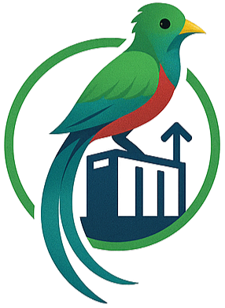

  

<h1 align="center">Sistema de Automatización IMPORCOMGUA</h1>

Proyecto realizado por:

| Nombre                                   | Carné     |
|------------------------------------------|-----------|
| Bilhán Jehiel López Miranda              | 201612369 |
| José Alberto Alarcón Chigua              | 201346084 |
| Jaqueline Michelle Cifuentes Rodas       | 201130968 |
| Hector Adolfo Son Chiché                 | 201730347 |
| Estuardo Israel Ramos Gomez              | 201830358 |
| Luis Nery Cifuentes Rodas                | 202030482 |
| Manuel Antonio Rojas Paxtor              | 202030799 |

## Documentación
Para ver la documentación, referirse [aquí](./docs/)
