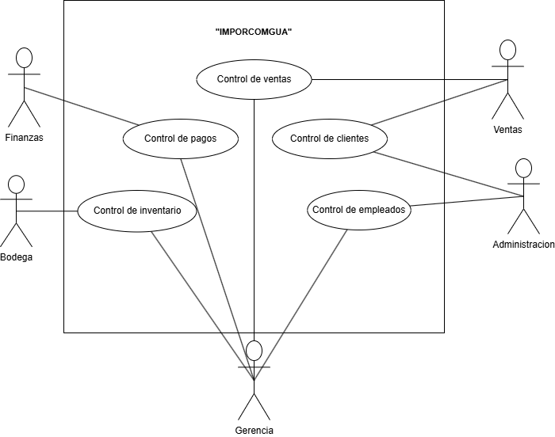
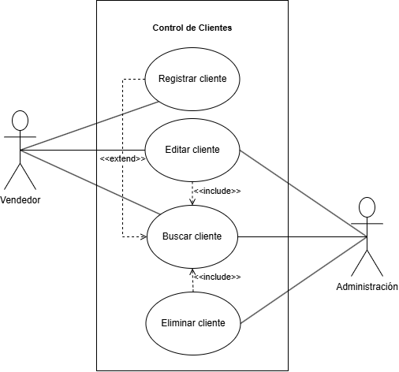
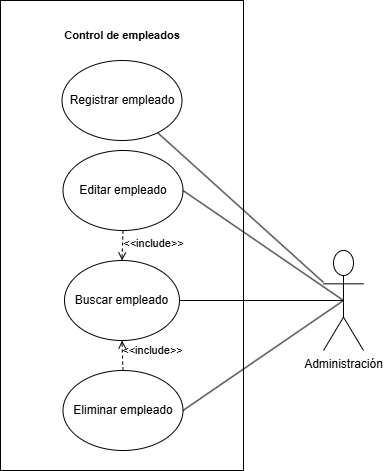
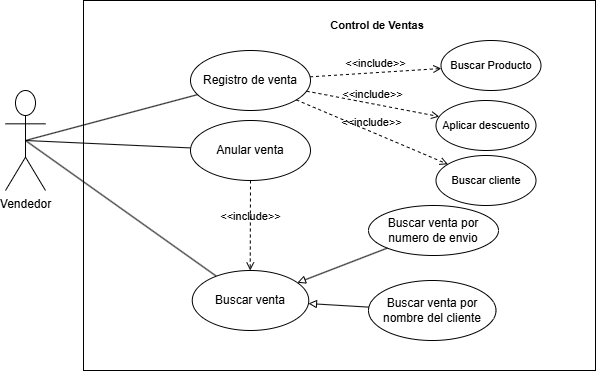
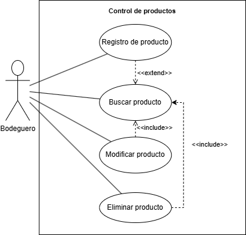
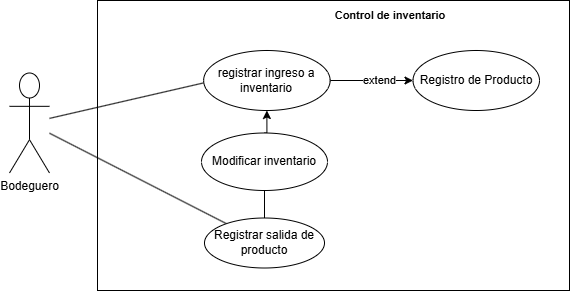
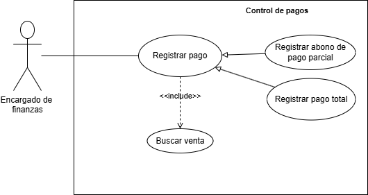

# Fase 1 - Documentacion Sistema de Automatización IMPORCOMGUA

## 1. Core del Negocio
### Descripcion
IMPORCOMGUA es una empresa guatemalteca dedicada al comercio de importaciones, especializada en la adquisición y distribución de productos provenientes del extranjero para su comercialización en el mercado nacional. Su modelo de negocio se centra en gestionar de forma eficiente el proceso completo de importación, almacenamiento, venta y entrega de mercancías, trabajando directamente con clientes y vendedores en distintas regiones del país.

### Stakeholders
* Gerente general: Recibe reportes clave, toma desiciones estrategicas para el negocio. 
* Area de ventas: Registran ventas dentro del sistema, consultan comisiones y gestiona clientes.
* Area de inventario: Ingresan y actualizan el stock de productos dentro de bodega.
* Area de finanzas: Se encarga de controlar los pagos (completos o abonados) de las ventas y realizacion de pagos a vendedores.
* Area administrativa: Gestion de vendedores y comisiones.
* Area de logistica: Se encarga de la gestion de importaciones, validaciones del DUCA y documentacion.

### Diagrama CDU de alto nivel

### Primera descomposición

## 2. Casos de uso expandidos
### Diagramas

### Descripciones

## 3. Drivers arquitectonicos
### Requerimientos funcionales críticos
* **RF01 Registrar cliente**: El sistema debe permitir registrar un nuevo cliente con sus datos personales.

* **RF02 Editar cliente**: El sistema debe permitir modificar los datos de un cliente existente.

* **RF03 Eliminar cliente**: El sistema debe permitir eliminar un cliente registrado.

* **RF04 Buscar cliente**: El sistema debe permitir buscar clientes por distintos criterios.

* **RF05 Registrar producto**: El sistema debe permitir registrar un nuevo producto en el inventario.

* **RF06 Modificar producto**: El sistema debe permitir modificar los detalles de un producto existente.

* **RF07 Eliminar producto**: El sistema debe permitir eliminar productos del inventario.

* **RF08 Buscar producto**: El sistema debe permitir buscar productos por diferentes criterios.

* **RF09 Registrar venta**: El sistema debe permitir registrar una nueva venta con los datos del cliente y productos vendidos.

* **RF10 Anular venta**: El sistema debe permitir anular ventas realizadas anteriormente.

* **RF11 Buscar venta**: El sistema debe permitir buscar ventas realizadas por diferentes parámetros.

* **RF12 Aplicar descuento**: El sistema debe permitir aplicar descuentos en las ventas según condiciones definidas.

* **RF13 Registrar salida de inventario**: El sistema debe permitir registrar la salida de productos por ventas u otros motivos.

* **RF14 Registrar ingreso a inventario**: El sistema debe permitir registrar el ingreso de productos al inventario.

* **RF15 Modificar inventario**: El sistema debe permitir realizar ajustes manuales al inventario registrado.

* **RF16 Registrar empleado**: El sistema debe permitir registrar nuevos empleados con sus datos.

* **RF17 Editar empleado**: El sistema debe permitir modificar los datos de un empleado existente.

* **RF18 Eliminar empleado**: El sistema debe permitir eliminar empleados registrados.

* **RF19 Buscar empleado**: El sistema debe permitir buscar empleados por diferentes criterios.

### Requerimientos no funcionales