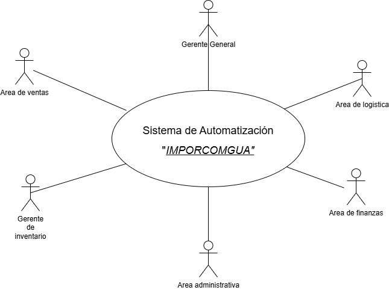

# Fase 1 - Sistema de Automatización IMPORCOMGUA
## Core del Negocio
1. Descripcion
IMPORCOMGUA es una empresa guatemalteca dedicada al comercio de importaciones, especializada en la adquisición y distribución de productos provenientes del extranjero para su comercialización en el mercado nacional. Su modelo de negocio se centra en gestionar de forma eficiente el proceso completo de importación, almacenamiento, venta y entrega de mercancías, trabajando directamente con clientes y vendedores en distintas regiones del país.

2. Stakeholders
* Gerente general: Recibe reportes clave, toma desiciones estrategicas para el negocio. 
* Area de ventas: Registran ventas dentro del sistema, consultan comisiones y gestiona clientes.
* Area de inventario: Ingresan y actualizan el stock de productos dentro de bodega.
* Area de finanzas: Se encarga de controlar los pagos (completos o abonados) de las ventas y realizacion de pagos a vendedores.
* Area administrativa: Gestion de vendedores y comisiones.
* Area de logistica: Se encarga de la gestion de importaciones, validaciones del DUCA y documentacion.

3. Diagrama CDU de alto nivel

