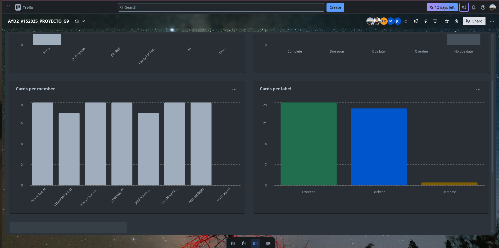

# Fase 1 - Documentacion Sistema de Automatización IMPORCOMGUA
## Tabla de contenido
1. [Core del Negocio](#1-core-del-negocio)
2. [Casos de Uso Expandidos](#2-casos-de-uso-expandidos)
3. [Drivers Arquitectónicos](#3-drivers-arquitectónicos)
4. [Matrices de Trazabilidad](#4-matrices-de-trazabilidad)
5. [Estructuras Arquitectonicas y estilos arquitectonicos](#5-estructuras-arquitectonicas-y-estilos-arquitectonicos)
7. [Diagrama de despliegue](#7-diagrama-de-despliegue)
8. [Diagrama Entidad Relación](#8-diagrama-entidad-relación)
10. [Gestión del Proyecto](#10-gestión-del-proyecto)

## 1. Core del Negocio
### Descripcion
IMPORCOMGUA es una empresa guatemalteca dedicada al comercio de importaciones, especializada en la adquisición y distribución de productos provenientes del extranjero para su comercialización en el mercado nacional. Su modelo de negocio se centra en gestionar de forma eficiente el proceso completo de importación, almacenamiento, venta y entrega de mercancías, trabajando directamente con clientes y vendedores en distintas regiones del país.

### Stakeholders
* **Gerente general**: Recibe reportes clave, toma desiciones estrategicas para el negocio. 
* **Ventas**: Registran ventas dentro del sistema, consultan comisiones y gestiona clientes.
* **Bodega**: Registran ingresos y egresos de bodega, gestionan inventario y productos.
* **Finanzas**: Se encarga de controlar los pagos (completos o abonados) de las ventas realizadas.
* **Administracion**: Gestion de vendedores, empleados y comisiones.

### Diagrama CDU de Alto Nivel

### Primera Descomposición

## 2. Casos de Uso Expandidos
### Diagramas

### Listado
- **CDU01 - Registrar Cliente**
- **CDU02 - Actualizar Información del Cliente** 
- **CDU03 - Dar de Baja a Cliente**
- **CDU04 - Efectuar Venta**
- **CDU05 - Aplicar Descuento**
- **CDU06 - Modificar Cantidades en Inventario**
- **CDU07 - Anular Venta**
- **CDU08 - Encontrar Venta**
- **CDU09 - Realizar Pago**
- **CDU10 - Registrar Empleado**
- **CDU11 - Actualizar Información del Empleado**
- **CDU12 - Dar de Baja a Empleado** 
- **CDU13 - Registrar Producto**  
- **CDU14 - Actualizar Información del Producto**
- **CDU15 - Dar de Baja a Producto**
- **CDU16 - Registrar Ingreso a Bodega**
- **CDU17 - Registrar Salida de Bodega**
- **CDU18 - Generar Reporte de Clientes**
- **CDU19 - Generar Reporte de Ventas**
- **CDU20 - Generar Reporte de Empleados**
- **CDU21 - Generar Reporte de Bodega**
- **CDU22 - Generar Reporte de Pagos**
- **CDU23 - Búsqueda de Cliente**
- **CDU24 - Búsqueda de Producto**
- **CDU25 - Búsqueda de Empleado**

### Descripciones

| **ID**                      | CDU01                   |
|-----------------------------|-------------------------|
| **Nombre**                  | Registrar Cliente       |
| **Actores**                 | Empleado de Ventas      |
| **Propósito**               | Formalizar la incorporación de nuevos clientes para habilitar relaciones comerciales y procesos de venta. |
| **Resumen**                 | Este proceso se inicia cuando un empleado de ventas identifica a un nuevo cliente interesado en establecer una relación comercial. Se recopilan los datos necesarios para su registro formal, con el objetivo de permitir futuras transacciones, seguimiento comercial y segmentación estratégica. |
| **Curso Normal de eventos** | 1. El empleado identifica a un cliente potencial.   2. Se recopilan los datos relevantes del cliente (identificación, contacto, ubicación).   3. Se valida que el cliente no haya sido previamente registrado.   4. Se formaliza el alta del cliente como parte del portafolio comercial.   5. Se confirma la incorporación y se habilita el historial comercial. |
| **Cursos alternos**         | 3a. Si el cliente ya existe en el portafolio, se notifica al empleado y se sugiere revisar o actualizar su información.   2a. Si los datos recopilados son incompletos, se solicita al empleado completarlos antes de continuar. |
| **Prioridad**               | Alta                    |
| **Mejoras**                 | 1. Establecer un proceso de seguimiento posterior al registro para aumentar la conversión en ventas.   2. Incorporar una categorización del cliente según su potencial comercial desde el momento del alta. |
| **Otras secciones**         | No aplica               |

| **ID**                      | CDU02                   |
|-----------------------------|-------------------------|
| **Nombre**                  | Actualizar Información del Cliente |
| **Actores**                 | Empleado de Ventas      |
| **Propósito**               | Mantener actualizada la información comercial y de contacto de los clientes para asegurar la eficacia en las operaciones y la gestión de relaciones. |
| **Resumen**                 | Este proceso se inicia cuando un empleado de ventas identifica cambios en los datos de un cliente, como nueva dirección, contacto actualizado o modificaciones en su perfil comercial. La actualización oportuna de esta información permite conservar relaciones comerciales vigentes, prevenir errores y planificar interacciones estratégicas. |
| **Curso Normal de eventos** | 1. El empleado identifica que un cliente tiene datos desactualizados o incorrectos.   2. Se recopila la información verificada directamente con el cliente o por medios oficiales.   3. Se revisa y modifica la información registrada del cliente.   4. Se confirma que los datos estén completos y actualizados.   5. Se documenta la modificación como parte del seguimiento comercial. |
| **Cursos alternos**         | 2a. Si no se logra verificar la nueva información, se posterga la actualización hasta obtener confirmación válida.   4a. Si los datos resultan inconsistentes con el historial comercial, se notifica al área correspondiente para revisión adicional. |
| **Prioridad**               | Alta                    |
| **Mejoras**                 | 1. Utilizar cada actualización como punto de contacto para fortalecer la relación con el cliente.   2. Aplicar criterios de clasificación comercial según los cambios detectados para ajustar estrategias de venta o retención. |
| **Otras secciones**         | No aplica               |

| **ID**                      | CDU03                   |
|-----------------------------|-------------------------|
| **Nombre**                  | Dar de Baja a Cliente   |
| **Actores**                 | Administrador del Sistema |
| **Propósito**               | Retirar del portafolio comercial a clientes que ya no mantienen una relación activa con la organización. |
| **Resumen**                 | Este proceso se lleva a cabo cuando se identifica que un cliente ha cesado su relación comercial con la empresa, ya sea por decisión propia, inactividad prolongada o criterios estratégicos definidos. Dar de baja a un cliente permite depurar la base activa, focalizar esfuerzos en relaciones vigentes y optimizar la asignación de recursos comerciales. |
| **Curso Normal de eventos** | 1. Se determina que un cliente no presenta actividad comercial reciente o ha solicitado su exclusión.   2. Se valida el cumplimiento de criterios establecidos para la baja.   3. Se documentan los motivos de finalización de relación.   4. Se formaliza la exclusión del cliente del portafolio activo.   5. Se conserva el historial del cliente para análisis y referencia futura. |
| **Cursos alternos**         | 2a. Si el cliente aún presenta obligaciones pendientes, se pospone la baja hasta su resolución.   3a. Si los motivos no están claros o justificados, se solicita revisión adicional por parte de la unidad comercial. |
| **Prioridad**               | Alta                    |
| **Mejoras**                 | 1. Establecer indicadores automáticos de inactividad para identificar oportunamente clientes candidatos a baja.   2. Analizar patrones de baja para fortalecer políticas de retención y servicio. |
| **Otras secciones**         | No aplica               |

| **ID**                      | CDU04                   |
|-----------------------------|-------------------------|
| **Nombre**                  | Efectuar venta             |
| **Actores**                 | Vendedor                 |
| **Propósito**               | Proposito               |
| **Resumen**                 | El caso de uso se inicia cuando el vendedor concreta una negociación con el cliente y procede a registrar la venta. Se verifica la disponibilidad del producto, se determinan las condiciones de pago y se confirma el acuerdo. El proceso finaliza con el registro de la venta. |
| **Curso Normal de eventos** | 1. El vendedor recibe una lista de los productos que desea adquirir el cliente   2. El vendedor verifica la disponibilidad del inventario o existencia del producto con el bodeguero.   3. El vendedor acuerda con el cliente el precio, condiciones de pago y forma de entrega.   4. Se formaliza la venta, dejando constancia del metodo de pago y los datos del cliente.   5. Se informa al cliente el detalle final de la venta y condiciones acordadas.|
| **Cursos alternos**         | 	2a. Si el producto no está disponible, se informa al cliente y se ofrecen alternativas.   3a. Si no se llega a un acuerdo comercial, la venta se suspende.           |
| **Prioridad**               | Alta                    |
| **Mejoras**                 |  1. Incorporar catálogo actualizado de productos para mejorar la precisión en las ofertas.      |
| **Otras secciones**         |                         |
| **Seccion**                 | Venta con oferta    |
|                             | 1. El vendedor consulta si existen ofertas vigentes para los productos seleccionados.   2. Aplica el descuento correspondiente al precio de venta.   |

| **ID**                      | CDU05                             |
|-----------------------------|-----------------------------------|
| **Nombre**                  | Aplicar descuento                 |
| **Actores**                 | Vendedor                          |
| **Propósito**               | Ajustar el total de una venta aplicando un descuento global conforme a políticas comerciales. |
| **Resumen**                 | Durante el proceso de facturación, el vendedor evalúa si el cliente cumple condiciones específicas. Si es así, se aplica un único descuento al total de la venta, modificando el monto final antes de generar el comprobante. |
| **Curso Normal de eventos** | 1. Vendedor completa los productos de la venta.   2. Evalúa si aplica un descuento global.   3. Ingresa el porcentaje o monto autorizado.   4. Se recalcula el total de la venta.   5. Se muestra el nuevo total con descuento aplicado. |
| **Cursos alternos**         | 1. Si el descuento excede el límite permitido, se solicita autorización del supervisor.   2. Si el cliente no cumple condiciones, no se permite aplicar descuento. |
| **Prioridad**               | Media                             |
| **Mejoras**                 | Sugerencias automáticas de descuento según historial de cliente   Registro histórico para análisis comercial |
| **Otras secciones**         |                                   |
| **Seccion**                 | Gestión de ventas               |
|                             | 1. Evaluación de condiciones   2. Aplicación de descuento validado |

| **ID**                      | CDU06                                   |
|-----------------------------|-----------------------------------------|
| **Nombre**                  | Modificar cantidades en inventario      |
| **Actores**                 | Empleado de Bodega                                  |
| **Propósito**               | Ajustar manualmente cantidades en inventario por errores, mermas o eventos especiales. |
| **Resumen**                 | La bodega puede ajustar las existencias cuando hay errores detectados, roturas, productos vencidos o devoluciones. Este caso de uso registra una entrada o salida ajustada del inventario, asegurando trazabilidad. |
| **Curso Normal de eventos** | 1. Personal de bodega detecta discrepancia.   2. Registra observación y motivo del ajuste.   3. Modifica cantidad correspondiente (ingreso o salida).   4. El sistema actualiza total de unidades y guarda registro del movimiento. |
| **Cursos alternos**         | 1. Si el ajuste es por lote dañado, se notifica a proveedor.   2. Si hay diferencia grave, se remite al área de control interno. |
| **Prioridad**               | Alta                                     |
| **Mejoras**                 | Validación cruzada de inventario con ventas   Reporte mensual de ajustes realizados |
| **Otras secciones**         |                                         |
| **Seccion**                 | Gestión de bodega                        |
|                             | No aplica |

| **ID**                      | CDU07                    |
|-----------------------------|-------------------------|
| **Nombre**                  | Anular Venta             |
| **Actores**                 | Vendedor                 |
| **Propósito**               | Permitir al vendedor anular una venta para corregir errores o atender solicitudes de clientes antes de su entrega o facturación definitiva.               |
| **Resumen**                 | El caso de uso inicia cuando el vendedor detecta la necesidad de anular una venta registrada. Para ello, primero localiza la venta. Una vez encontrada, el vendedor valida la condición para la anulación y procede a registrar la anulación. El caso finaliza cuando la venta queda anulada y se actualizan los registros correspondientes. |
| **Curso Normal de eventos** | 1. El vendedor identifica la necesidad de anular una venta.   2. El vendedor busca la venta por número de envío o nombre del cliente.   3. Se localiza la venta y se verifica que cumple los criterios para ser anulada (no entregada, sin pagos aplicados).   4. El vendedor solicita la anulación de la venta.   5. Se registra la anulación   6. Se le notifica al vendedor que la venta fue anulada. |
| **Cursos alternos**         | 3a. Si la venta no existe, se notifica al vendedor y se solicita revisar los datos.   3b. Si la venta no cumple los criterios para anulación, se informa al vendedor y se cancela el proceso. |
| **Prioridad**               | Media-Alta                    |
| **Mejoras**                 | 1. Registrar el motivo de anulación.   2. Notificar a finanzas y logística sobre la anulación.      |
| **Otras secciones**         |  No aplica   |

| **ID**                      | CDU08                    |
|-----------------------------|-------------------------|
| **Nombre**                  | Encontrar venta             |
| **Actores**                 | Vendedor, Encargado de Bodega, Cajero |
| **Propósito**               | Localizar información de una venta para validación, seguimiento o atención al cliente. |
| **Resumen**                 | El caso de uso se inicia cuando el vendedor, cajero o encargado de bodega necesita consultar los datos de una venta. El proceso permite localizar la venta con base en distintos criterios de búsqueda. El caso de uso finaliza cuando se le notifica al actor el resultado de la busqueda. |
| **Curso Normal de eventos** | 1. El vendedor, cajero o encargado de bodega detecta la necesidad de consultar una venta, ya sea para validar una entrega, resolver una duda del cliente o realizar una gestión operativa.   2. El actor solicita acceso al registro de ventas disponibles en la empresa.   3. El actor busca la venta utilizando como referencia el número de envío proporcionado por el cliente y/o el nombre del cliente.   4. El responsable del registro de ventas verifica la existencia de la venta en los archivos de respaldo.   5. Se extrae la venta.   6. Se le notifica al actor el resultado de la busqueda.|
| **Cursos alternos**         | 4a. Si el número de envío o el nombre del cliente no coinciden con ningún registro, el responsable informa al actor que no se encontró la venta solicitada.|           |
| **Prioridad**               | Alta                    |
| **Mejoras**                 | 1. Designar responsables por área para atender búsquedas urgentes de ventas.   2. Registrar intentos de búsqueda fallidos para mejorar la calidad de los datos.|
| **Otras secciones**         | No aplica                         |

| **ID**                      | CDU09                              |
|-----------------------------|------------------------------------|
| **Nombre**                  | Realizar pago                      |
| **Actores**                 | Cajero              |
| **Propósito**               | Gestionar el seguimiento y aplicación de pagos realizados por clientes a cuentas por cobrar. |
| **Resumen**                 | Como parte del proceso de recuperación de crédito, el encargado de finanzas recibe, valida y aplica los pagos efectuados por los clientes. Estos pagos pueden ser abonos parciales o liquidaciones totales de ventas a crédito. El proceso garantiza la trazabilidad del cumplimiento de pago, facilita la gestión financiera y contribuye al flujo de caja de la empresa. |
| **Curso Normal de eventos** | 1. Cliente realiza un pago correspondiente a una deuda pendiente.   2. El encargado de finanzas recibe y valida el pago con la documentación de respaldo.   3. Se registra internamente como parte del control de cuentas por cobrar.   4. Se actualiza el estado de la cuenta del cliente para reflejar el nuevo saldo.   5. Se conserva historial de pagos para auditoría y conciliación. |
| **Cursos alternos**         | 1. Si el pago no coincide con el monto esperado, se registra como abono parcial y se notifica al cliente.   2. Si el cliente presenta problemas con el método de pago, se difiere el registro hasta validación. |
| **Prioridad**               | Alta                               |
| **Mejoras**                 | Establecer alertas de vencimiento de pago   Automatizar conciliación con bancos |
| **Otras secciones**         |                                    |
| **Seccion**                 | Control de pagos  |
|                             | 1. Recepción del pago   2. Aplicación al saldo   3. Gestión del estado de cuenta |

| **ID**                      | CDU10                                |
|-----------------------------|--------------------------------------|
| **Nombre**                  | Registrar empleado                   |
| **Actores**                 | Administración                      |
| **Propósito**               | Iniciar formalmente la incorporación de un nuevo empleado a la organización. |
| **Resumen**                 | Este caso de uso inicia cuando se requiere registrar un nuevo empleado. Involucra recopilar sus datos personales y laborales para su integración en la empresa. El caso finaliza cuando el empleado queda formalmente registrado para desempeñar sus funciones. |
| **Curso Normal de eventos** | 1. Administración identifica la necesidad de registrar un nuevo empleado.   2. Recolecta los datos básicos: nombres, apellidos, dirección, teléfono y comisión (si aplica).   3. Verifica que la información esté completa y correcta.   4. Valida que no exista duplicidad.   5. Formaliza el ingreso del empleado en la organización. |
| **Cursos alternos**         | 1. Si la información es incompleta, se solicita corrección.   2. Si ya existe un registro similar, se detiene el proceso y se revisa con recursos humanos. |
| **Prioridad**               | Alta                                 |
| **Mejoras**                 | Incorporar verificación automática de duplicidad   Integrar validaciones con área de RRHH |
| **Otras secciones**         |                                      |
| **Seccion**                 | Gestión de empleados             |
|                             | 1. Validación de datos básicos   2. Aprobación por responsable administrativo |

| **ID**                      | CDU11                                |
|-----------------------------|--------------------------------------|
| **Nombre**                  | Actualizar información del empleado  |
| **Actores**                 | Administración                      |
| **Propósito**               | Mantener actualizada la información del personal dentro de la organización. |
| **Resumen**                 | Este caso de uso se activa cuando hay necesidad de modificar datos de un empleado por cambios personales, errores previos o ajustes contractuales. Finaliza cuando los datos actualizados están verificados y aceptados en el expediente del empleado. |
| **Curso Normal de eventos** | 1. Administración detecta o recibe solicitud de cambio.   2. Verifica si el cambio es válido y autorizado.   3. Accede al expediente del empleado.   4. Realiza los ajustes necesarios.   5. Confirma y documenta el cambio. |
| **Cursos alternos**         | 1. Si el dato a modificar requiere aprobación de RRHH, se deriva para revisión.   2. Si el dato es sensible, se solicita validación adicional. |
| **Prioridad**               | Media                                |
| **Mejoras**                 | Agregar control de cambios y motivo de edición |
| **Otras secciones**         |                                      |
| **Seccion**                 | Gestión de empleados   |
|                             | 1. Cambios validados por supervisor   2. Documentación de fecha y responsable |

| **ID**                      | CDU12                                |
|-----------------------------|--------------------------------------|
| **Nombre**                  | Dar de baja a empleado               |
| **Actores**                 | Administración                      |
| **Propósito**               | Formalizar el retiro de un empleado de la organización. |
| **Resumen**                 | Este caso de uso inicia cuando un empleado deja de trabajar en la empresa, ya sea por renuncia, despido o retiro programado. Se realiza una baja formal en la organización, asegurando que el historial se mantenga pero su actividad operativa se detenga. |
| **Curso Normal de eventos** | 1. Administración recibe la notificación de retiro.   2. Revisa que el empleado no tenga pendientes activos.   3. Confirma la salida.   4. Registra la baja y su justificación.   5. El empleado queda fuera del sistema operativo, pero su información permanece en el archivo histórico. |
| **Cursos alternos**         | 1. Si aún hay procesos abiertos asociados al empleado, se solicita resolverlos antes de dar la baja. |
| **Prioridad**               | Alta                                 |
| **Mejoras**                 | Implementar bitácora de bajas   Automatizar alertas de pendientes asociados |
| **Otras secciones**         |                                      |
| **Seccion**                 | Gestión de empleados                    |
|                             | 1. Validación de egreso administrativo   2. Registro del motivo y fecha |

| **ID**                      | CDU13                   |
|-----------------------------|-------------------------|
| **Nombre**                  | Registrar producto      |
| **Actores**                 | Empleado de Bodega      |
| **Propósito**               | Permitir que el empleado de bodega pueda ingresar un producto nuevo y sus características, al inventario de la empresa. |
| **Resumen**                 | El empleado de bodega registra un producto que se ha agregado al inventario recientemente. |
| **Curso Normal de eventos** | 1. El empleado de bodega detecta que es necesario registrar un nuevo producto.  2. Adquiere los datos relevantes del producto como el código, el nombre, la unidad de presentación (Unidad, Fardo o Paquete) y la cantidad de unidades por presentación.  3. Verifica que la información esté completa y correcta. 4. Valida que no exista duplicidad.   5. Formaliza el ingreso del producto en el negocio.  |
| **Cursos alternos**         | 3a. Si se omite un dato obligatorio, el empleado de bodega solicita el dato faltante.  4a. Si el código del producto ya ha sido registrado, el empleado de bodega informa el error para colocar un código diferente. |
| **Prioridad**               | Alta                                                                                  |
| **Mejoras**                 | Disminución de errores de inventario por productos no registrados o mal clasificados. |
| **Otras secciones**         |                                                                                       |
| **Seccion**                 | Gestión de inventario                                                                 |
|                             | 1. Registro validado por encargado de bodega                                          |

| **ID**                      | CDU14                   |
|-----------------------------|-------------------------|
| **Nombre**                  | Actualizar información del producto |
| **Actores**                 | Empleado de Bodega      |
| **Propósito**               | Modificar los datos ingresados anteriormente de un producto |
| **Resumen**                 | Cuando hay errores o cambios en la información de un producto, el empleado puede actualizar esa información para mantener el inventario preciso y coherente. |
| **Curso Normal de eventos** | 1. El empleado busca el producto por código o nombre. 2. Modifica uno o varios datos según sea necesario. 3. Archiva la información del producto con los cambios realizados. |
| **Cursos alternos**         | 1a. Si el producto no existe, el empleado de bodega informa al negocio.   2a. Si se pretende modificar el código de un producto a uno ya existente, el negocio no debe aceptar dicho cambio. |
| **Prioridad**               | Alta                    |
| **Mejoras**                 | Corrige posibles errores y mantiene alineados los datos con la realidad operativa. |
| **Otras secciones**         | No aplica |

| **ID**                      | CDU15                   |
|-----------------------------|-------------------------|
| **Nombre**                  | Dar de baja a producto  |
| **Actores**                 | Empleado de Bodega      |
| **Propósito**               | Inhabilitar productos que ya no están disponibles o han salido del catálogo comercial. |
| **Resumen**                 | El empleado de bodega puede definir un producto como inactivo para evitar que se siga utilizando en nuevos registros de ventas o ingresos de inventario, sin eliminar su historial del negocio. |
| **Curso Normal de eventos** | 1. El empleado busca el producto que desea dar de baja.   2. Revisa que el producto no se haya descontinuado y confirma que el producto no se utiliza activamente.   3. Especifica el estado del producto como "Inactivo" o "Dado de baja".   4. El negocio restringe el uso del producto en operaciones futuras. |
| **Cursos alternos**         | 2a. Si el producto tiene inventario actual disponible, el encargado de bodega podría advertir antes de permitir su baja.   2b. Si el producto está asociado a una venta en proceso, el negocio impide la baja de este hasta que la venta se concrete. |
| **Prioridad**               | Media                    |
| **Mejoras**                 | Evita errores al utilizar productos descontinuados y mejora la organización del catálogo.      |
| **Otras secciones**         | No aplica                        |

| **ID**                      | CDU16                                |
|-----------------------------|--------------------------------------|
| **Nombre**                  | Registrar ingreso a bodega  |
| **Actores**                 | Encargado de bodega                      |
| **Propósito**               | Asegurar que los productos importados sean registrados al momento de ingresar fisicamente a la bodega. |
| **Resumen**                 | Este caso de uso inicia cuando se recibe una carga de productos importados en las instalaciones de IMPORCOMGUA. El encargado de bodega realiza la verificación física del cargamento con base en la documentación de importación y procede a registrar el ingreso. Finaliza cuando los productos han sido contabilizados y ubicados correctamente dentro del almacén. |
| **Curso Normal de eventos** | 1. El Encargado de Bodega recibe el cargamento y la documentación de importación.   2. Se realiza la inspección física de los productos recibidos.   3. Se verifica la coincidencia entre la carga física y los documentos.   4. Registra el ingreso en el libro de control.   5. Modifica las cantidades en inventario según lo recibido.   6. Almacena los productos en las ubicaciones asignadas dentro de la bodega. |
| **Cursos alternos**         | 1. Si existen diferencias entre la carga y la documentación, se notifica al área de Administracion para revisión.   2. Si la mercancía presenta daños, se documenta y se genera un reporte para el área de compras o administracion. |
| **Prioridad**               | Alta                                |
| **Mejoras**                 | Implementar código de barras para agilizar el registro y reducir errores manuales. |
| **Otras secciones**         |                                      |
| **Seccion**                 | Gestión de inventarios   |
|                             | 1. Registro validado por encargado de bodega.   2. Notificación automática al departamento de ventas sobre disponibilidad. |

| **ID**                      | CDU17                                |
|-----------------------------|--------------------------------------|
| **Nombre**                  | Registrar salida de bodega  |
| **Actores**                 | Encargado de bodega                      |
| **Propósito**               | Garantizar que la salida de productos desde la bodega esté debidamente registrada, verificada y controlada, manteniendo actualizado el inventario. |
| **Resumen**                 | Este caso de uso inicia cuando se autoriza la salida de productos desde la bodega, ya sea por entrega a clientes o traslado interno. El Encargado de Bodega verifica la solicitud, prepara los productos, actualiza el inventario y documenta la salida. Finaliza cuando los productos han salido físicamente y su registro ha sido completado. |
| **Curso Normal de eventos** | 1. El Encargado de Bodega recibe la solicitud de salida de productos.   2. Verifica que la solicitud esté autorizada y que los productos estén disponibles.   3. Se prepara los productos para entrega o traslado.   4. Se registra la salida en el libro de control.   5. Modifica las cantidades en inventario para reflejar la salida.   6. Entrega la mercancía al destinatario autorizado, con firma de recepción. |
| **Cursos alternos**         | 1. Si los productos solicitados no están disponibles, se notifica a administracion o ventas.   2. Si la solicitud no está autorizada, se rechaza y se informa al solicitante. |
| **Prioridad**               | Alta                                |
| **Mejoras**                 | Implementar sistema de alertas para productos con baja rotación y control de fechas de vencimiento. |
| **Otras secciones**         |                                      |
| **Seccion**                 | Gestión de inventarios   |
|                             | 1. Guía de remisión, factura, registro de venta.   2. Notificación al departamento de ventas sobre niveles de inventario críticos. |

| **ID**                 | CDU18                                                                       |
|------------------------|-----------------------------------------------------------------------------|
| **Nombre**             | Generar Reporte de Clientes                                                 |
| **Actores**            | Gerente General                                                             |
| **Propósito**          | Analizar la información registrada de los clientes.                         |
| **Resumen**            | Se genera un informe con la información detallada de clientes.              |
| **Curso normal**       | 1. El Gerente obtiene la información archivada de los clientes.   2. Organiza la información según el campo o campos que se desea analizar.   3. Identifica solo los datos requeridos.   4. Analiza los datos seleccionados para representarlos en un informe.   |
| **Cursos alternos**    | 1a. No hay clientes registrados.                                            |
| **Prioridad**          | Media                                                                       |
| **Mejoras**            | Permite análisis comercial y toma de decisiones.                            |
| **Otras secciones**    | No aplica                                                                   |

| **ID**                 | CDU19                                                                              |
|------------------------|------------------------------------------------------------------------------------|
| **Nombre**             | Generar Reporte de Ventas                                                          |
| **Actores**            | Gerente General                                                                    |
| **Propósito**          | Analizar las ventas realizadas en un período específico.                           |
| **Resumen**            | Se genera un informe con la información detallada de las ventas.                   |
| **Curso normal**       | 1. El gerente obtiene la información archivada de las ventas.   2. Organiza la información según el campo o campos que se desea analizar.   3. Identifica solo los datos requeridos.   4. Analiza los datos seleccionados para representarlos en un informe.   |
| **Cursos alternos**    | 1a. No hay ventas en el rango de fechas.                                           |
| **Prioridad**          | Alta                                                                               |
| **Mejoras**            | Facilita el control de ingresos y seguimiento de operaciones.                      |
| **Otras secciones**    | No aplica                                                                          |

| **ID**                 | CDU20                                                                   |
|------------------------|-------------------------------------------------------------------------|
| **Nombre**             | Generar Reporte de Empleados                                            |
| **Actores**            | Gerente General                                                         |
| **Propósito**          | Visualizar la información de los vendedores y su desempeño.             |
| **Resumen**            | Se genera un informe con la información detallada de los empleados.     |
| **Curso normal**       | 1. El gerente obtiene la información archivada de los empleados.   2. Organiza la información según el campo o campos que se desea analizar.   3. Identifica solo los datos requeridos.   4. Analiza los datos seleccionados para representarlos en un informe.   |
| **Cursos alternos**    | 1a. No hay empleados registrados.                                       |
| **Prioridad**          | Media                                                                   |
| **Mejoras**            | Mejora la gestión de personal y control de comisiones.                  |
| **Otras secciones**    | No aplica                                                               |

| **ID**                 | CDU21                                                                       |
|------------------------|-----------------------------------------------------------------------------|
| **Nombre**             | Generar Reporte de Bodega                                                   |
| **Actores**            | Gerente General                                                             |
| **Propósito**          | Consultar el estado actual del inventario en bodega.                        |
| **Resumen**            | Muestra existencia de productos, cantidades disponibles y apartadas.        |
| **Curso normal**       | 1. El gerente obtiene la información relacionada con el inventario.   2. Organiza la información según el campo o campos que se desea analizar.   3. Identifica solo los datos requeridos.   4. Analiza los datos seleccionados para representarlos en un informe.   |
| **Cursos alternos**    | 1a. No hay productos registrados.                                           |
| **Prioridad**          | Alta                                                                        |
| **Mejoras**            | Mejora el control de inventario y planificación de compras.                 |
| **Otras secciones**    | No aplica                                                                   |

| **ID**                 | CDU22                                                                       |
|------------------------|-----------------------------------------------------------------------------|
| **Nombre**             | Generar Reporte de Pagos                                                    |
| **Actores**            | Gerente General                                                             |
| **Propósito**          | Consultar los pagos realizados por los clientes y estados de cuenta.        |
| **Resumen**            | Lista abonos realizados, fechas, montos, bancos y estado de cobro.          |
| **Curso normal**       | 1. El gerente obtiene la información relacionada con los pagos.   2. Organiza la información según el campo o campos que se desea analizar.   3. Identifica solo los datos requeridos.   4. Analiza los datos seleccionados para representarlos en un informe.   |
| **Cursos alternos**    | 1a. No hay pagos registrados.                                               |
| **Prioridad**          | Alta                                                                        |
| **Mejoras**            | Ayuda al seguimiento efectivo de cuentas por cobrar.                        |
| **Otras secciones**    | No aplica                                                                   |

| **ID**                      | CDU23                   |
|-----------------------------|-------------------------|
| **Nombre**                  | Búsqueda de Cliente     |
| **Actores**                 | Empleado de Ventas      |
| **Propósito**               | Acceder rápidamente a la información de un cliente para facilitar decisiones comerciales, seguimiento o actualización de relación. |
| **Resumen**                 | Este proceso se activa cuando se necesita consultar la situación o los datos relevantes de un cliente en el contexto de una operación comercial. La identificación oportuna del cliente permite mejorar la atención, mantener relaciones efectivas y tomar decisiones basadas en el historial del vínculo comercial. |
| **Curso Normal de eventos** | 1. El empleado identifica la necesidad de consultar un cliente.   2. Define uno o varios criterios de búsqueda basados en información conocida del cliente.   3. Se revisan los datos disponibles sobre el cliente localizado.   4. Se procede con la gestión comercial o administrativa requerida. |
| **Cursos alternos**         | 3a. Si no se encuentra información del cliente, se valora realizar un registro nuevo o solicitar verificación a otra área. |
| **Prioridad**               | Media                   |
| **Mejoras**                 | 1. Establecer criterios de priorización por valor comercial del cliente.   2. Integrar datos de interacción previa para enriquecer la gestión. |
| **Otras secciones**         | No aplica               |

| **ID**                      | CDU24                   |
|-----------------------------|-------------------------|
| **Nombre**                  | Búsqueda de Producto    |
| **Actores**                 | Empleado de Ventas, Bodeguero |
| **Propósito**               | Localizar productos relevantes para atención a clientes, control de inventario o soporte a decisiones de venta. |
| **Resumen**                 | Este proceso permite a los responsables identificar productos disponibles o relacionados, ya sea para preparar una cotización, atender una consulta o verificar el estado de inventario. Su correcta ejecución permite mejorar la eficiencia comercial, evitar pérdidas de tiempo y brindar mejor asesoramiento. |
| **Curso Normal de eventos** | 1. El empleado requiere identificar un producto por razones comerciales o logísticas.   2. Se determinan las características conocidas del producto a localizar.   3. Se analiza la información del producto recuperado.   4. Se continúa con la acción comercial o de inventario según corresponda. |
| **Cursos alternos**         | 3a. Si no se identifica el producto, se plantea la búsqueda de equivalentes o alternativas de venta. |
| **Prioridad**               | Media                   |
| **Mejoras**                 | 1. Incorporar criterios de rotación, margen o demanda como filtros de búsqueda.   2. Facilitar el acceso a información complementaria útil para el cierre de la venta. |
| **Otras secciones**         | No aplica               |

| **ID**                      | CDU25                   |
|-----------------------------|-------------------------|
| **Nombre**                  | Búsqueda de Empleado    |
| **Actores**                 | Administrador del Sistema |
| **Propósito**               | Consultar información del personal para toma de decisiones operativas, asignación de tareas o evaluación administrativa. |
| **Resumen**                 | Esta actividad permite al responsable acceder a la información de un empleado para dar seguimiento a sus funciones, validar su estado actual o asignarle responsabilidades. Facilita la correcta gestión de los recursos humanos en función de las necesidades de la operación. |
| **Curso Normal de eventos** | 1. El responsable identifica la necesidad de consultar a un miembro del personal.   2. Se determina un criterio de identificación o clasificación.   3. Se revisa el perfil o historial del empleado.   4. Se toma la decisión correspondiente o se coordina la acción administrativa. |
| **Cursos alternos**         | 3a. Si no se encuentra al empleado, se coordina con recursos humanos para validar su situación o estado. |
| **Prioridad**               | Media                   |
| **Mejoras**                 | 1. Considerar atributos operativos como experiencia, desempeño o disponibilidad para facilitar decisiones estratégicas.   2. Incluir métricas laborales en los criterios de consulta. |
| **Otras secciones**         | No aplica               |

## 3. Drivers arquitectónicos
### Requerimientos funcionales críticos (RF)

#### Gestión de Clientes
* **RF01 - Registro de Cliente**: El sistema debe permitir registrar un nuevo cliente con sus datos personales.
* **RF02 - Edición de Cliente**: El sistema debe permitir modificar los datos de un cliente existente.
* **RF03 - Eliminación de Cliente**: El sistema debe permitir eliminar un cliente registrado.
* **RF04 - Busqueda de Cliente**: El sistema debe permitir buscar clientes por distintos criterios.

#### Gestión de Bodega
* **RF05 - Registro de Producto**: El sistema debe permitir registrar un nuevo producto en el inventario.
* **RF06 - Edición de Producto**: El sistema debe permitir modificar los detalles de un producto existente.
* **RF07 - Eliminación de Producto**: El sistema debe permitir eliminar productos del inventario.
* **RF08 - Busqueda de Producto**: El sistema debe permitir buscar productos por diferentes criterios.
* **RF09 - Registro de Salida de Inventario**: El sistema debe permitir registrar la salida de productos por ventas u otros motivos.
* **RF10 - Registro de Ingreso a Inventario**: El sistema debe permitir registrar el ingreso de productos al inventario.
* **RF11 - Modificacion de Stock en Inventario**: El sistema debe permitir realizar ajustes manuales al inventario registrado.

#### Gestión de Ventas
* **RF12 - Registro de Venta**: El sistema debe permitir registrar una nueva venta con los datos del cliente y productos vendidos.
* **RF13 - Anulación de Venta**: El sistema debe permitir anular ventas realizadas anteriormente.
* **RF14 - Busqueda de Ventas**: El sistema debe permitir buscar ventas realizadas por diferentes parámetros.
* **RF15 - Aplicación de Descuento**: El sistema debe permitir aplicar descuentos en las ventas según condiciones definidas.

#### Gestión de Empleados
* **RF16 - Registro de Empleado**: El sistema debe permitir registrar nuevos empleados con sus datos.
* **RF17 - Edición de Empleado**: El sistema debe permitir modificar los datos de un empleado existente.
* **RF18 - Eliminación de Empleado**: El sistema debe permitir eliminar empleados registrados.
* **RF19 - Busqueda de Empleado**: El sistema debe permitir buscar empleados por diferentes criterios.

#### Generación de Reportes
* **RF20 - Reportes de Empleados**: El sistema debe permitir la generacion de reportes estrategicos sobre empleados.
* **RF21 - Reportes de Clientes**: El sistema debe permitir la generacion de reportes estrategicos sobre clientes.
* **RF22 - Reportes de Pagos**: El sistema debe permitir la generacion de reportes estrategicos relacionado a los pagos.
* **RF23 - Reportes de Ventas**: El sistema debe permitir la generacion de reportes estrategicos sobre ventas.
* **RF24 - Reportes de Bodega**: El sistema debe permitir la generacion de reportes estrategicos relacionados con bodega.

#### Control de Pagos
* **RF25 - Registro de Pago**: El sistema debe permitir el registro de abonos y/o pagos completos para una venta.

### Requisitos No Funcionales (RNF)

#### Seguridad
- **RNF01 - Autenticación**: El sistema requiere autenticación para acceder a funcionalidades de administración como la gestión de clientes, productos, ventas e inventario.
- **RNF02 - Seguridad en Contraseñas**: Las contraseñas de los usuarios se almacenarán cifradas utilizando el algoritmo AES.
- **RNF03 - Duración de Sesiones**: Las sesiones de usuario tendrán una duración máxima de 24 horas, después de lo cual se cerrarán automáticamente.
- **RNF04 - Autorización**: Solo los usuarios autenticados y autorizados podrán registrar ventas, cobros, salidas de bodega o realizar pagos.

#### Eficiencia
- **RNF05 - Operaciones Rapidas**: Las operaciones críticas como registro de ventas, pagos y búsquedas de envíos deberán completarse en menos de 3 segundos.
- **RNF06 - Soporte a Varias Transacciones**: El sistema debe soportar al menos 10,000 transacciones simultáneas sin degradar el rendimiento, especialmente en los módulos de inventario y ventas.

#### Usabilidad
- **RNF07 - UI para Escritorio**: La interfaz adaptarse correctamente a dispositivos de escritorios.
- **RNF08 - UI Especifica por Rol**: Las opciones del menú deben estar claramente categorizadas y organizadas según los roles de usuario (administrador, supervisor, vendedor).
- **RNF09 - UI Intuitiva**: El usuario debe poder realizar búsquedas de clientes, ventas o productos de forma intuitiva desde cualquier vista relevante.

#### Disponibilidad
- **RNF10 - Alta Disponibilidad**: El sistema deberá garantizar una disponibilidad del 99.99% anual.
- **RNF11 - CI/CD**: La implementación de nuevas funcionalidades no debe requerir la interrupción del servicio activo para los usuarios.

#### Escalabilidad
- **RNF12 - Arquitectura Escalable**: La arquitectura del sistema debe ser modular y permitir la integración de nuevos módulos sin afectar el rendimiento existente.

#### Mantenibilidad
- **RNF13 - Clara Documentación**: El código fuente deberá documentarse adecuadamente, siguiendo estándares de nomenclatura y comentarios estructurados.

#### Portabilidad
- **RNF14 - Portabilidad de la Aplicación**: El sistema debe poder ejecutarse en distintos navegadores web modernos (Chrome, Firefox, Edge).
- **RNF15 - Entorno de Despliegue**: La solución debe estar preparada para ser desplegada en ambientes Linux.

## 4. Matrices de Trazabilidad
### Stakeholders vs Requerimientos
|Stakeholders\Requerimientos|RF01 Registro de Cliente|RF02 Edicion de Cliente|RF03 Eliminacion de Cliente|RF04 Busqueda de Cliente|RF05 Registro de Producto|RF06 Edicion de Producto|RF07 Eliminacion de Producto|RF08 Busqueda de Producto|RF09 Registro de Salida de Inventario|RF10 Registro de Ingreso a Inventario|RF11 Modificacion de Stock en Inventario|RF12 Registro de Venta|RF13 Anulacion de Venta|RF14 Busqueda de Venta|RF15 Aplicacion de Descuento|RF16 Registro de Empleado|RF17 Edicion de Empleado|RF18 Eliminacion de Empleado|RF19 Busqueda de Empleado|RF20 Reportes de Empleados|RF21 Reportes de Clientes|RF22 Reporte de Pagos|RF23 Reporte de Ventas|RF24 Reportes de Bodega|RF25 Registro de Pagos|
|--|:--:|:--:|:--:|:--:|:--:|:--:|:--:|:--:|:--:|:--:|:--:|:--:|:--:|:--:|:--:|:--:|:--:|:--:|:--:|:--:|:--:|:--:|:--:|:--:|:--:|
|Gerente General| | | | | | | | | | | | | | | | | | | |X|X|X|X|X| |
|Ventas|X|X| |X| | | | | | | |X|X|X|X| | | | | | | | | | |
|Bodega| | | | |X|X|X|X|X|X|X| | | | | | | | | | | | | | |
|Finanzas| | | | | | | | | | | | | | | | | | | | | | | | |X|
|Administracion| | |X|X| | | | | | | | | | | |X|X|X|X| | | | | | | |

### Stakeholders vs CDU
|Stakeholders\CDU|CDU01 Registrar Cliente|CDU02 Actualizar Informacion del Cliente|CDU03 Dar de Baja a Cliente|CDU04 Efectuar Venta|CDU05 Aplicar Descuento|CDU06 Modificar Cantidades en Inventario|CDU07 Anular Venta|CDU08 Encontrar Venta|CDU09 Realizar Pago|CDU10 Registrar Empleado|CDU11 Actualizar Información del Empleado|CDU12 Dar de Baja a Empleado|CDU13 Registrar Producto|CDU14 Actualizar Información del Producto|CDU15 Dar de Baja a Producto|CDU16 Registrar Ingreso a Bodega|CDU17 Registrar Salida de Bodega|CDU18 Generar Reporte de Clientes|CDU19 Generar Reporte de Ventas|CDU20 Generar Reporte de Empleados|CDU21 Generar Reporte de Bodega|CDU22 Generar Reporte de Pagos|CDU 23 Busqueda de Cliente|CDU24 Busqueda de Producto|CDU25 Busqueda de Empleado|
|--|:--:|:--:|:--:|:--:|:--:|:--:|:--:|:--:|:--:|:--:|:--:|:--:|:--:|:--:|:--:|:--:|:--:|:--:|:--:|:--:|:--:|:--:|:--:|:--:|:--:|
|Gerente General| | | | | | | | | | | | | | | | | |X|X|X|X|X| | | |
|Ventas|X|X| |X|X| |X|X| | | | | | | | | | | | | | |X| | |
|Bodega| | | | | |X| | | | | | |X|X|X|X|X| | | | | | |X| |
|Finanzas| | | | | | | |X|X| | | | | | | | | | | | | | | | |
|Administracion| | |X| | | | | | |X|X|X| | | | | | | | | | |X| |X|

### Requerimientos vs CDU
|Requerimientos\CDU|CDU01 Registrar Cliente|CDU02 Actualizar Informacion del Cliente|CDU03 Dar de Baja a Cliente|CDU04 Efectuar Venta|CDU05 Aplicar Descuento|CDU06 Modificar Cantidades en Inventario|CDU07 Anular Venta|CDU08 Encontrar Venta|CDU09 Realizar Pago|CDU10 Registrar Empleado|CDU11 Actualizar Información del Empleado|CDU12 Dar de Baja a Empleado|CDU13 Registrar Producto|CDU14 Actualizar Información del Producto|CDU15 Dar de Baja a Producto|CDU16 Registrar Ingreso a Bodega|CDU17 Registrar Salida de Bodega|CDU18 Generar Reporte de Clientes|CDU19 Generar Reporte de Ventas|CDU20 Generar Reporte de Empleados|CDU21 Generar Reporte de Bodega|CDU22 Generar Reporte de Pagos|CDU 23 Busqueda de Cliente|CDU24 Busqueda de Producto|CDU25 Busqueda de Empleado|
|--|:--:|:--:|:--:|:--:|:--:|:--:|:--:|:--:|:--:|:--:|:--:|:--:|:--:|:--:|:--:|:--:|:--:|:--:|:--:|:--:|:--:|:--:|:--:|:--:|:--:|
|RF01 Registro de Cliente|X| | | | | | | | | | | | | | | | | | | | | | | | |
|RF02 Edición de Cliente| |X| | | | | | | | | | | | | | | | | | | | |X| | |
|RF03 Eliminación de Cliente| | |X| | | | | | | | | | | | | | | | | | | |X| | |
|RF04 Busqueda de Cliente|X|X|X|X| | | | | | | | | | | | | | | | | | |X| | |
|RF05 Registro de Producto| | | | | | | | | | | | |X| | | | | | | | | | | | |
|RF06 Edición de Producto| | | | | | | | | | | | | |X| | | | | | | | | |X| |
|RF07 Eliminación de Producto| | | | | | | | | | | | | | |X| | | | | | | | |X| |
|RF08 Busqueda de Producto| | | | | | | | | | | | |X|X|X| | | | | | | | |X| |
|RF09 Registro de Salida de Inventario| | | | | | | |X| | | | | | | | |X| | | | | | | | |
|RF10 Registro de Ingreso a Inventario| | | | | | | | | | | | | | | |X| | | | | | | | | |
|RF11 Modificacion de Stock en Inventario| | | | | |X| | | | | | | | | | | | | | | | | | | |
|RF12 Registro de Venta| | | |X| | | | | | | | | | | | | | | | | | |X| | |
|RF13 Anulación de Venta| | | | | | |X|X| | | | | | | | | | | | | | | | | |
|RF14 Busqueda de Ventas| | | | | | |X|X|X| | | | | | | |X| | | | | | | | |
|RF15 Aplicación de Descuento| | | |X| | | | | | | | | | | | | | | | | | | | | |
|RF16 Registro de Empleado| | | | | | | | | |X| | | | | | | | | | | | | | | |
|RF17 Edición de Empleado| | | | | | | | | | |X| | | | | | | | | | | | | |X|
|RF18 Eliminación de Empleado| | | | | | | | | | | |X| | | | | | | | | | | | |X|
|RF19 Busqueda de Empleado| | | | | | | | | |X|X|X| | | | | | | | | | | | |X|
|RF20 Reportes de Empleados| | | | | | | | | | | | | | | | | | | |X| | | | | |
|RF21 Reportes de Clientes| | | | | | | | | | | | | | | | | |X| | | | | | | |
|RF22 Reportes de Pagos| | | | | | | | | | | | | | | | | | | | | |X| | | |
|RF23 Reportes de Ventas| | | | | | | | | | | | | | | | | | |X| | | | | | |
|RF24 Reportes de Bodega| | | | | | | | | | | | | | | | | | | | |X| | | | |
|RF25 Registro de Pago| | | | | | | |X|X| | | | | | | | | | | | | | | | |

## 5. Estructuras Arquitectonicas y estilos arquitectonicos
### Identificación de estructuras arquitectónicas
> aun falta

### Selección de los estilos arquitectónicos
El sistema propuesto para IMPORCOMGUA se construirá combinando tres estilos arquitectónicos que permiten una estructura clara, modular y fácil de entender. Cada uno responde a necesidades específicas del negocio y del desarrollo del software.
#### Arquitectura en o por capas
Este estilo organiza el sistema en capas independientes, donde cada una cumple una función específica: presentación, lógica de negocio y persistencia de datos.

Se eligió porque facilita la organización del sistema, separa responsabilidades, y mejora el mantenimiento y comprensión general de su funcionamiento.

#### Call return: Cliente-Servidor
Este estilo define una comunicación entre un cliente que solicita servicios y un servidor que los atiende mediante un esquema de petición-respuesta.

Se seleccionó porque estructura la interacción entre quien usa el sistema y quien lo procesa, permitiendo un flujo de datos claro.

#### Call return: SOA (Service-Oriented Architecture)
Este estilo implica que el sistema se estructura en servicios funcionales independientes, cada uno encargado de un proceso del negocio.

Se eligió porque permite una organización modular por funcionalidades, lo cual facilita el desarrollo, la documentación y futuras integraciones.
## 7. Diagrama de despliegue
Se puede observar el diagrama con mas detalle en el siguiente [PDF](./assets/architecture/deplyment-diagram-IMPERCOMGUA.pdf)

### Justificacion de Frameworks y tecnologias
Para el desarrollo del backend se ha optado por el framework Spring Boot sobre el lenguaje de programación Java, debido a sus ventajas en la construcción de aplicaciones empresariales robustas y escalables.

#### Java + Spring Boot (Backend)
El backend de IMPORCOMGUA estará construido con Spring Boot, un framework moderno sobre Java que organiza el código en capas bien definidas: controladores, servicios y acceso a datos. Esto ayuda en la arquitectura a:

* Establecer una arquitectura lógica clara, donde cada módulo funcional (ventas, pagos, inventario, empleados, etc.) tiene una ubicación específica y fácilmente identificable.

* Mantener una correspondencia directa entre los casos de uso documentados y su implementación técnica, lo que facilita la trazabilidad entre los requerimientos del negocio y el código fuente.

* Soporte nativo para seguridad, autenticación y validación, útil para la gestión de usuarios y control de acceso.

* Aprovechar herramientas como validadores, control de errores, seguridad y configuración externa, que permiten enfocar el desarrollo en la lógica del negocio.

En el diagrama de despliegue, el contenedor del backend representa este núcleo funcional del sistema, separado del frontend y la base de datos, facilitando su comprensión y mantenimiento independiente.
#### Base de datos: PostgreSQL
Se eligió PostgreSQL como sistema de gestión de base de datos relacional (RDBMS) por su solidez, compatibilidad con estándares SQL y extensiones avanzadas. Estas serviran en la arquitectura para:

* Manejar relaciones complejas y garantizar integridad referencial entre las entidades del sistema.

* Ejecutar consultas eficientes gracias a índices, funciones agregadas y soporte para procedimientos almacenados.

* Integración eficiente con librerías de persistencia como JPA/Hibernate, lo cual facilita el mapeo de entidades desde PostgreSQL.

* Ofrecer una solución escalable y segura, sin costos de licenciamiento.

PostgreSQL asegura un backend de datos confiable, ideal para los módulos de ventas, pagos, inventario y clientes.

#### Angular (Frontend)
El frontend será desarrollado con Angular, un framework basado en TypeScript que permite organizar la interfaz de usuario en componentes reutilizables, cada uno asociado a una funcionalidad del sistema.

* Permite desarrollar una interfaz modular y reutilizable, organizada por componentes.

* Angular facilita el desarrollo de una interfaz rica y reactiva, que mejora la experiencia del usuario sin comprometer la claridad estructural del sistema.

* Integra mecanismos nativos de consumo de APIs RESTful, facilitando la conexión con el backend de Spring Boot.

* Se integrará una librería de componentes visuales para garantizar consistencia, accesibilidad y eficiencia en el diseño de pantallas.

Gracias a esta división, es fácil comprender cómo las vistas del usuario se comunican con el sistema y cómo cada acción corresponde a un flujo entre componentes documentado gráficamente.

#### Docker (Contenedores)
La utilización de contenedores Docker tanto para el backend como para el frontend:

* Representar de forma visual y clara la arquitectura modular del sistema, como se muestra en el diagrama de despliegue.
*Despliegue estandarizado y portable.

* Facilitar el aislamiento y la independencia de los servicios, lo que mejora la comprensión del entorno de ejecución del sistema.

* Reproducir fácilmente entornos de desarrollo y producción, garantizando coherencia en todas las etapas del ciclo de vida del software.

* Posibilita una mayor integración con herramientas CI/CD en fases futuras del proyecto

La combinación de Spring Boot + PostgreSQL + Angular, empaquetados en contenedores Docker, responde a las necesidades del proyecto IMPORCOMGUA en términos de modularidad, mantenibilidad, escalabilidad y portabilidad. 

## 8. Diagrama Entidad Relación
Se puede observar el diagrama con mas detalle en el siguiente [enlace](https://drive.google.com/file/d/1PPOJJGdaRHBWIRjnqh1tqRXfl900WQL-/view?usp=sharing)

## 10. Gestión del Proyecto

Utilizamos [Trello](https://trello.com) para planificar, asignar y seguir el avance de tareas del proyecto. A continuación, algunas capturas:

### Acceso al Tablero Trello

Puedes ver el tablero completo aquí:  
🔗 [Tablero Trello de IMPORCOMGUA](https://trello.com/invite/b/6847ba5b69dfcd9af1c397e7/ATTIb7e79dd9e84a644089e6ced6e8777d17530D11B0/ayd2v1s2025proyectog9)