# Fase 3 - Documentacion Sistema de Automatización IMPORCOMGUA

## Tabla de contenido
1. [Core del Negocio](#1-core-del-negocio)
2. [Casos de Uso Expandidos](#2-casos-de-uso-expandidos)
3. [Drivers Arquitectónicos](#3-drivers-arquitectónicos)
4. [Matrices de Trazabilidad](#4-matrices-de-trazabilidad)
5. [Estructuras Arquitectonicas y estilos arquitectonicos](#5-estructuras-arquitectonicas-y-estilos-arquitectonicos)
6. [Diagrama de despliegue](#7-diagrama-de-despliegue)
7. [Diagrama Entidad Relación](#8-diagrama-entidad-relación)
8. [Gestión del Proyecto](#10-gestión-del-proyecto)

## 1. Core del Negocio
### Descripcion
IMPORCOMGUA es una empresa guatemalteca dedicada al comercio de importaciones, especializada en la adquisición y distribución de productos provenientes del extranjero para su comercialización en el mercado nacional. Su modelo de negocio se centra en gestionar de forma eficiente el proceso completo de importación, almacenamiento, venta y entrega de mercancías, trabajando directamente con clientes y vendedores en distintas regiones del país.

### Stakeholders
* **Gerentes**: Gestionan procesos internos de IMPORCOMGUA. (Registrar, Actualizar, Dar de Baja)
* **Vendedor**: Provee informacion sobre si mismo y las ventas a favor de IMPORCOMGUA.
* **Cliente**: Provee informacion de si mismo para IMPORCOMGUA.
* **Aduana**: Se encarga de controlar que los tramites aduaneros esten en orden.
* **Proveedor**: Se encarga de proveer de productos a IMPORCOMGUA.

### Diagrama CDU de Alto Nivel
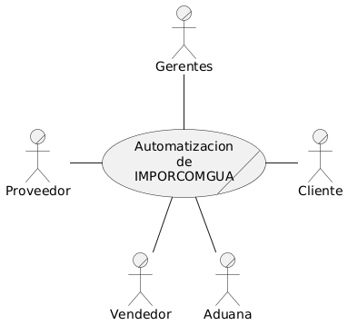

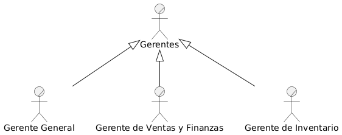

### Primera Descomposición
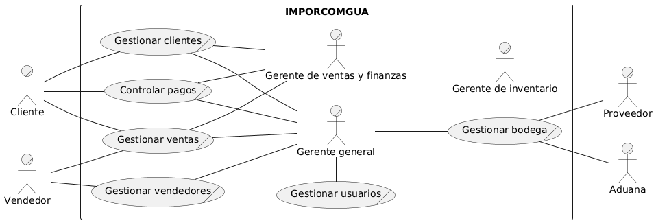

## 2. Casos de Uso Expandidos
### Diagramas
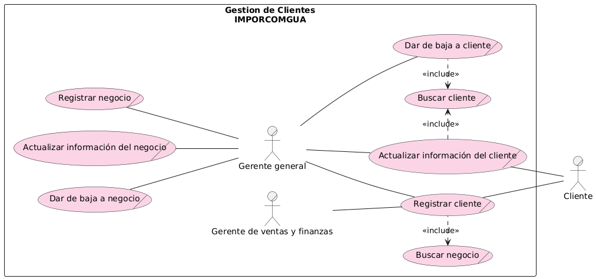

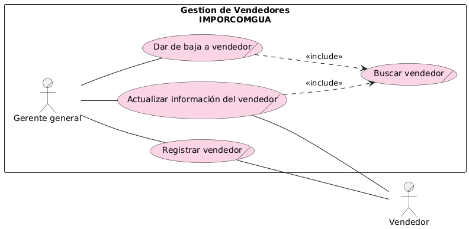

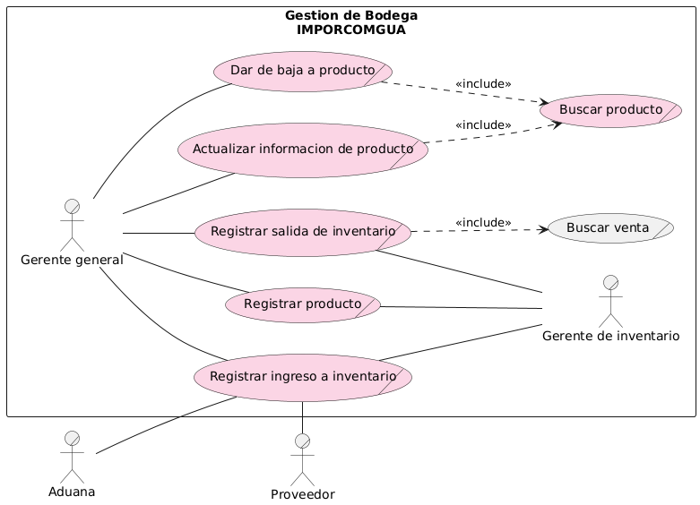

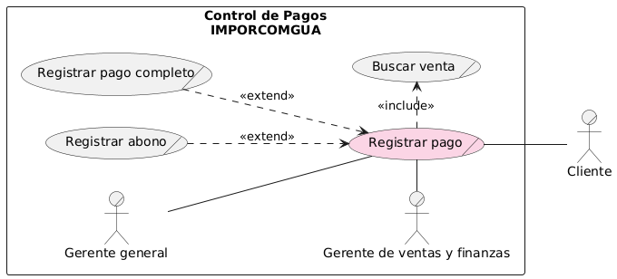

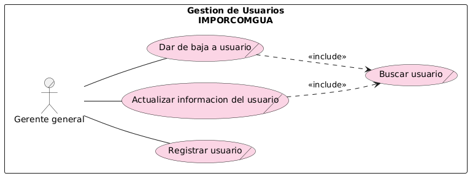

### Listado
- **CDU100 - Gestionar Clientes**
- **CDU200 - Gestionar Ventas** 
- **CDU300 - Gestionar Bodega**
- **CDU400 - Gestionar Vendedores**
- **CDU500 - Controlar Pagos**
- **CDU600 - Gestionar Usuarios**

### Descripciones

| **ID**               | CDU100 - Gestionar Clientes                                                                                              |
|----------------------|--------------------------------------------------------------------------------------------------------------------------|
| **Nombre**           | Gestionar Clientes                                                                                                        |
| **Actores**          | Administrador, Cliente                                                                                                    |
| **Propósito**        | Administrar la información y relaciones con clientes para facilitar procesos comerciales y mejorar la fidelización.      |
| **Resumen**          | Involucra registrar nuevos clientes, actualizar datos existentes, eliminar clientes inactivos y realizar búsquedas eficientes. Permite mantener un portafolio comercial actualizado y confiable para optimizar la gestión de ventas y atención al cliente. |
| **Curso Normal de eventos** | 1. Identificación de cliente nuevo o existente. 2. Registro o actualización de datos personales y contacto. 3. Validación de integridad y duplicidad. 4. Confirmación de alta, edición o eliminación según corresponda. 5. Uso de funcionalidades de búsqueda para acceder a la información del cliente. |
| **Cursos alternos**  | 2a. Si los datos están incompletos o inválidos, se solicita corrección. 3a. Si el cliente está activo y no debe eliminarse, se bloquea la eliminación. |
| **Prioridad**        | Alta                                                                                                                     |
| **Mejoras**          | 1. Automatizar validaciones y alertas para mantener calidad de datos. 2. Integrar análisis para segmentación avanzada y seguimiento comercial. |
| **Otras secciones**  | Registro, Edición, Eliminación y Búsqueda de clientes (RF01-RF08)                                                        |

| **ID**               | CDU200 - Gestionar Ventas                                                                                                 |
|----------------------|---------------------------------------------------------------------------------------------------------------------------|
| **Nombre**           | Gestionar Ventas                                                                                                          |
| **Actores**          | Administrador, Vendedor, Cliente                                                                                          |
| **Propósito**        | Formalizar, controlar y optimizar el proceso comercial desde la venta hasta la facturación.                               |
| **Resumen**          | Comprende registrar nuevas ventas con datos completos del cliente y productos, anular ventas cuando sea necesario y facilitar la búsqueda de ventas realizadas. Esto garantiza el correcto flujo comercial, financiero y la satisfacción del cliente. |
| **Curso Normal de eventos** | 1. Identificación de oportunidad de venta. 2. Registro de productos y cliente. 3. Cálculo y registro del pago. 4. Emisión de factura y actualización de inventario. 5. Consulta y anulación de ventas cuando corresponda. 6. Seguimiento y análisis de las transacciones realizadas. |
| **Cursos alternos**  | 3a. Si un pago es rechazado o insuficiente, se gestionan alternativas o cancelación. 2a. Si la venta debe anularse, se procesa la reversión y notificación. |
| **Prioridad**        | Alta                                                                                                                     |
| **Mejoras**          | 1. Integrar métodos de pago electrónico para mayor agilidad. 2. Implementar seguimiento postventa para mejorar la experiencia. |
| **Otras secciones**  | Registro, Anulación y Búsqueda de ventas (RF15-RF18)                                                                     |

| **ID**               | CDU300 - Gestionar Bodega                                                                                                 |
|----------------------|---------------------------------------------------------------------------------------------------------------------------|
| **Nombre**           | Gestionar Bodega                                                                                                          |
| **Actores**          | Administrador, Aduana, Proveedor                                                                                          |
| **Propósito**        | Controlar el inventario para asegurar disponibilidad, trazabilidad y eficiencia operativa.                               |
| **Resumen**          | Incluye registrar nuevos productos en inventario, actualizar sus detalles, eliminar productos obsoletos, búsqueda avanzada de productos, registrar fechas de salida y controlar ingresos y stock. Garantiza que el inventario refleje fielmente la realidad operativa y comercial. |
| **Curso Normal de eventos** | 1. Registro y actualización de productos. 2. Control del stock mediante entradas y salidas. 3. Realización de búsquedas para facilitar la gestión. 4. Generación de reportes e indicadores de inventario. 5. Manejo de inconsistencias o ajustes cuando se detectan. |
| **Cursos alternos**  | 1a. En caso de información incompleta o inconsistencias, se solicitan correcciones.                                       |
| **Prioridad**        | Alta                                                                                                                     |
| **Mejoras**          | 1. Mejorar automatización en control de inventarios. 2. Integrar sistemas aduaneros para agilizar procesos.             |
| **Otras secciones**  | Registro, Edición, Eliminación y Búsqueda de productos; Control de ingresos y salidas (RF09-RF14)                          |

| **ID**               | CDU400 - Gestionar Vendedores                                                                                             |
|----------------------|---------------------------------------------------------------------------------------------------------------------------|
| **Nombre**           | Gestionar Vendedores                                                                                                       |
| **Actores**          | Administrador, Vendedor                                                                                                    |
| **Propósito**        | Mantener un registro actualizado de vendedores para facilitar la gestión comercial y administrativa.                     |
| **Resumen**          | Incluye registro, actualización, eliminación y búsqueda de vendedores. Permite controlar el desempeño y la información del personal de ventas.                                                              |
| **Curso Normal de eventos** | 1. Identificación y registro de nuevo vendedor. 2. Actualización de datos personales y contacto. 3. Eliminación de registros obsoletos. 4. Uso de herramientas de búsqueda para consulta. |
| **Cursos alternos**  | 2a. Si los datos son incompletos, se solicita corrección. 3a. Si el vendedor tiene ventas activas, se bloquea la eliminación. |
| **Prioridad**        | Media                                                                                                                    |
| **Mejoras**          | 1. Implementar seguimiento de desempeño. 2. Integrar formación y evaluación continua.                                  |
| **Otras secciones**  | Registro, Edición, Eliminación y Búsqueda de vendedores (RF19-RF22)                                                      |

| **ID**               | CDU500 - Controlar Pagos                                                                                                  |
|----------------------|---------------------------------------------------------------------------------------------------------------------------|
| **Nombre**           | Controlar Pagos                                                                                                           |
| **Actores**          | Administrador, Cliente                                                                                                    |
| **Propósito**        | Gestionar el registro y control de pagos y abonos para asegurar la correcta liquidación de ventas.                        |
| **Resumen**          | Permite registrar pagos completos o parciales, consultar historiales y gestionar cobros pendientes, garantizando la correcta gestión financiera.                                                |
| **Curso Normal de eventos** | 1. Registro de pagos y abonos. 2. Validación y conciliación con ventas. 3. Consulta de estado de pagos. 4. Gestión de cobros pendientes. |
| **Cursos alternos**  | 2a. Si un pago es rechazado, se notifica para corrección. 3a. Si un pago está pendiente, se envían alertas de seguimiento.|
| **Prioridad**        | Alta                                                                                                                     |
| **Mejoras**          | 1. Integrar métodos de pago digitales. 2. Automatizar notificaciones y recordatorios.                                   |
| **Otras secciones**  | Registro y Consulta de pagos (RF23)

| **ID**               | CDU600 - Gestionar Usuarios                                                                                                       |
|----------------------|-----------------------------------------------------------------------------------------------------------------------------------|
| **Nombre**           | Gestionar Usuarios                                                                                                                |
| **Actores**          | Administrador                                                                                                                     |
| **Propósito**        | Permitir la administración completa de las cuentas de usuario para controlar el acceso al sistema y asignación de roles.         |
| **Resumen**          | Permite registrar, editar, eliminar y buscar usuarios, garantizando una gestión adecuada de las cuentas que acceden al sistema.  |
| **Curso Normal de eventos** | 1. Registro de nuevos usuarios con asignación de rol (RF24). 2. Edición de información de cuentas de usuario existentes (RF25). 3. Eliminación de cuentas de usuario (RF26). 4. Búsqueda de cuentas de usuario por criterios definidos (RF27). |
| **Cursos alternos**  | 1a. Si la información de registro es incompleta o inválida, el sistema solicita corrección. 2a. Si un usuario a eliminar tiene operaciones asociadas, se advierte antes de continuar. |
| **Prioridad**        | Alta                                                                                                                              |
| **Mejoras**          | 1. Implementar autenticación multifactor para mayor seguridad. 2. Permitir auditoría detallada de cambios en cuentas de usuario.|
| **Otras secciones**  | Registro, Edición, Eliminación y Búsqueda de Usuarios (RF24-RF27)   

## 3. Drivers arquitectónicos
### Requerimientos funcionales críticos (RF)

#### Gestión de Clientes
* **RF01 - Registro de Cliente**: El sistema debe permitir registrar un nuevo cliente con sus datos personales.
* **RF02 - Edición de Cliente**: El sistema debe permitir modificar los datos de un cliente existente.
* **RF03 - Eliminación de Cliente**: El sistema debe permitir eliminar un cliente registrado.
* **RF04 - Busqueda de Cliente**: El sistema debe permitir buscar clientes por distintos criterios.
* **RF05 - Registro de Negocio**: El sistema debe permitir registrar un nuevo negocios con sus datos personales.
* **RF06 - Edición de Negocio**: El sistema debe permitir modificar los datos de un negocios existente.
* **RF07 - Eliminación de Negocio**: El sistema debe permitir eliminar un negocios registrado.
* **RF08 - Busqueda de Negocio**: El sistema debe permitir buscar cnegocios por distintos criterios.

#### Gestión de Bodega
* **RF09 - Registro de Producto**: El sistema debe permitir registrar un nuevo producto en el inventario.
* **RF10 - Edición de Producto**: El sistema debe permitir modificar los detalles de un producto existente.
* **RF11 - Eliminación de Producto**: El sistema debe permitir eliminar productos del inventario.
* **RF12 - Busqueda de Producto**: El sistema debe permitir buscar productos por diferentes criterios.
* **RF13 - Establecer Fecha de Salida**: El sistema debe permitir registrar la salida de productos por ventas u otros motivos.
* **RF14 - Registrar Ingreso a Inventario**: El sistema debe permitir registrar el ingreso de productos y modificar stock en inventario.

#### Gestión de Ventas
* **RF15 - Registro de Venta**: El sistema debe permitir registrar una nueva venta con los datos del cliente y productos vendidos.
* **RF16 - Anulación de Venta**: El sistema debe permitir anular ventas realizadas anteriormente.
* **RF17 - Busqueda de Ventas**: El sistema debe permitir buscar ventas realizadas por diferentes parámetros.
* **RF18 - Notificar Bajo Stock**: El sistema notifica por correo al gerente de que el stock de un producto esta por debajo del umbral permitido.

#### Gestión de Vendedores
* **RF19 - Registro de Vendedor**: El sistema debe permitir registrar nuevos empleados con sus datos.
* **RF20 - Edición de Vendedor**: El sistema debe permitir modificar los datos de un empleado existente.
* **RF21 - Eliminación de Vendedor**: El sistema debe permitir eliminar empleados registrados.
* **RF22 - Busqueda de Vendedor**: El sistema debe permitir buscar empleados por diferentes criterios.

#### Control de Pagos
* **RF23 - Registro de Pago**: El sistema debe permitir el registro de abonos y/o pagos completos para una venta.

#### Gestion de Usuarios
* **RF24 - Registrar Usuario**: El sistema debe permitir el registro de usuario en el sistema y asignarles un rol.
* **RF25 - Edicion de Usuario**: El sistema debe permitir la edicion en base a las cuentas de usuario.
* **RF26 - Eliminacion de Usuario**: El sistema debe permitir dar de baja a un usuario.
* **RF27 - Buscar Usuario**: El sistema debe permitir buscar una cuenta de un usuario.

### Requisitos No Funcionales (RNF)

#### Eficiencia
- **RNF01 - Operaciones Rapidas**: Las operaciones críticas como registro de ventas, pagos y búsquedas de envíos deberán completarse en menos de 3 segundos.
- **RNF02 - Soporte a Varias Transacciones**: El sistema debe soportar al menos 10,000 transacciones simultáneas sin degradar el rendimiento, especialmente en los módulos de inventario y ventas.

#### Usabilidad
- **RNF03 - UI para Escritorio**: La interfaz adaptarse correctamente a dispositivos de escritorios.
- **RNF04 - UI Intuitiva**: El usuario debe poder realizar búsquedas de clientes, ventas o productos de forma intuitiva desde cualquier vista relevante.

#### Disponibilidad
- **RNF05 - Alta Disponibilidad**: El sistema deberá garantizar una disponibilidad del 99.99% anual.
- **RNF06 - CI/CD**: La implementación de nuevas funcionalidades no debe requerir la interrupción del servicio activo para los usuarios.

#### Escalabilidad
- **RNF07 - Arquitectura Escalable**: La arquitectura del sistema debe ser modular y permitir la integración de nuevos módulos sin afectar el rendimiento existente.

#### Mantenibilidad
- **RNF08 - Clara Documentación**: El código fuente deberá documentarse adecuadamente, siguiendo estándares de nomenclatura y comentarios estructurados.

### Requisitos de Restricción (Drivers de Restricción)

#### Técnicos
- **RNF09 - Aplicacion Web**: La aplicación debe ser desarrollada como una aplicación web accesible mediante navegadores modernos (Chrome, Firefox, Edge), sin requerir instalación en el dispositivo cliente.
- **RNF10 - Entorno de Despliegue**: La solución debe estar preparada para ser desplegada en cualquier entorno..

#### Operacionales
- **RNF11 - Ventas**: Los procesos de venta deben permitir pagos parciales, y manejar correctamente los saldos pendientes.
- **RNF12 - Eliminación de registros**: No se permite eliminación física de registros por normativas del negocio. Solo debe aplicarse baja lógica o estado "inactivo".
- **RNF13 - Modificacion en Stock**: Los procesos involucrados con el stock de productos en el inventario, deben de ser seguros y correctos, manteniendo uniformidad entre los ingresos y ventas.

#### Gestión de proyecto
- **RNF14 - Desarrollo del sistema**: El sistema debe desarrollarse en 3 fases durante un mes, según cronograma aprobado.
- **RNF15 - Metodología**: Se debe usar metodología ágil con tablero Kanban.

## 4. Matrices de Trazabilidad
### Stakeholders vs Requerimientos
|Stakeholders\Requerimientos|RF01 Registro Cliente|RF02 Edición Cliente|RF03 Eliminación Cliente|RF04 Busqueda Cliente|RF05 Registro Negocio|RF06 Edición Negocio|RF07 Eliminación Negocio|RF08 Busqueda Negocio|RF09 Registro Producto|RF10 Edición Producto|RF11 Eliminación Producto|RF12 Busqueda Producto|RF13 Establecer Salida|RF14 Ingreso Inventario|RF15 Registro Venta|RF16 Anulación Venta|RF17 Busqueda Venta|RF18 Notificar Bajo Stock|RF19 Registro Vendedor|RF20 Edición Vendedor|RF21 Eliminación Vendedor|RF22 Busqueda Vendedor|RF23 Registro Pago|RF24 Registrar Usuario|RF25 Edición Usuario|RF26 Eliminación Usuario|RF27 Buscar Usuario|
|--|:--:|:--:|:--:|:--:|:--:|:--:|:--:|:--:|:--:|:--:|:--:|:--:|:--:|:--:|:--:|:--:|:--:|:--:|:--:|:--:|:--:|:--:|:--:|:--:|:--:|:--:|:--:|
|Gerentes|X|X|X|X|X|X|X|X|X|X|X|X|X|X|X|X|X|X|X|X|X|X|X|X|X|X|X|
|Vendedor| | | | | | | | | | | | | | |X| | | |X|X| | | | | | | | | |
|Cliente|X|X| | | | | | | | | | | | |X| | | |  | | | |X| | | | |
|Aduana| | | | | | | | | | | | | |X| | | | | | | | | | | | | |
|Proveedor| | | | | | | | | | | | | |X| | | | | | | | | | | | |
### Stakeholders vs CDU
|Stakeholders\CDU|CDU100 - Gestionar Clientes|CDU200 - Gestionar Ventas|CDU300 - Gestionar Bodega|CDU400 - Gestionar Vendedores|CDU500 - Controlar Pagos|CDU600 - Gestionar Usuarios|
|--|:--:|:--:|:--:|:--:|:--:|:--:|
|Gerentes|X|X|X|X|X|X|
|Vendedor| |X| |X| | |
|Cliente|X|X| | |X| |
|Aduana| | |X| | |
|Proveedor| | |X| | |
### Requerimientos vs CDU
|Requerimientos\CDU|CDU100 - Gestionar Clientes|CDU200 - Gestionar Ventas|CDU300 - Gestionar Bodega|CDU400 - Gestionar Vendedores|CDU500 - Controlar Pagos|CDU600 - Gestionar Usuarios|
|--|:--:|:--:|:--:|:--:|:--:|:--:|
|RF01 Registro Cliente|X||||||
|RF02 Edición Cliente|X||||||
|RF03 Eliminación Cliente|X||||||
|RF04 Busqueda Cliente|X||||||
|RF05 Registro Cliente|X||||||
|RF06 Edición Cliente|X||||||
|RF07 Eliminación Cliente|X||||||
|RF08 Busqueda Cliente|X||||||
|RF09 Registro Producto|||X|||
|RF10 Edición Producto|||X|||
|RF11 Eliminación Producto|||X|||
|RF12 Busqueda Producto|||X|||
|RF13 Establecer Salida|||X|||
|RF14 Ingreso Inventario|||X|||
|RF15 Registro Venta||X||||
|RF16 Anulación Venta||X||||
|RF17 Busqueda Venta||X||||
|RF18 Notificar Bajo Stock||X|X|||
|RF19 Registro Vendedor||||X||
|RF20 Edición Vendedor||||X||
|RF21 Eliminación Vendedor||||X||
|RF22 Busqueda Vendedor||X||X||
|RF23 Registro Pago|||||X|
|RF24 Registrar Usuario||||||X|
|RF25 Edición Usuario||||||X|
|RF26 Eliminación Usuario||||||X|
|RF27 Buscar Usuario||||||X|

## 5. Estructuras Arquitectonicas y estilos arquitectonicos
### Identificación de estructuras arquitectónicas

### 5.1 Estructura Modular

Representa el sistema como un conjunto de módulos lógicos organizados por responsabilidad o funcionalidad. Cada módulo encapsula una parte del comportamiento del sistema y se comunica con los demás a través de interfaces bien definidas.

El sistema automatizado de IMPORCOMGUA estará compuesto por módulos como:

1. Gestión de clientes
2. Gestión de productos
3. Ventas
4. Pagos
5. Inventario
6. Reportes

Esta estructura ofre las siguientes ventajas:

1. Mejora la mantenibilidad y escalabilidad.
2. Facilita la asignación de tareas en el equipo de desarrollo.
3. Permite la reutilización de componentes en futuros proyectos o versiones.

### 5.2 Componentes y Conectores

Describe el sistema en términos de componentes ejecutables (por ejemplo, servicios, APIs, interfaces de usuario) y conectores que representan la interacción entre ellos (llamadas a funciones y protocolos de red).

En el siste automatizado de IMPORCOMGUA, esta estructura arquitectonica se podrá ver reflejada en:

1. Un frontend (cliente web) que se comunica con el backend.
2. Servicios expuestos que permiten la integración modular.
3. Conector HTTP/REST entre cliente y servidor.
4. Posibilidad de desacoplar funcionalidades para futuras integraciones externas.

Esta estructura ofre las siguientes ventajas:

1. Modela cómo fluye la información entre los componentes.
2. Permite analizar rendimiento, escalabilidad y tolerancia a fallos.
3. Ideal para arquitecturas orientadas a servicios y cliente-servidor.

### Selección de los estilos arquitectónicos
El sistema propuesto para IMPORCOMGUA se construirá combinando tres estilos arquitectónicos que permiten una estructura clara, modular y fácil de entender. Cada uno responde a necesidades específicas del negocio y del desarrollo del software.
#### Arquitectura en o por capas
Este estilo organiza el sistema en capas independientes, donde cada una cumple una función específica: presentación, lógica de negocio y persistencia de datos.

Se eligió porque facilita la organización del sistema, separa responsabilidades, y mejora el mantenimiento y comprensión general de su funcionamiento.

#### Call return: Cliente-Servidor
Este estilo define una comunicación entre un cliente que solicita servicios y un servidor que los atiende mediante un esquema de petición-respuesta.

Se seleccionó porque estructura la interacción entre quien usa el sistema y quien lo procesa, permitiendo un flujo de datos claro.

#### Call return: SOA (Service-Oriented Architecture)
Este estilo implica que el sistema se estructura en servicios funcionales independientes, cada uno encargado de un proceso del negocio.

Se eligió porque permite una organización modular por funcionalidades, lo cual facilita el desarrollo, la documentación y futuras integraciones.

## 6. Diagrama de despliegue (Componentes y Distribucion)

### 6.1 Diagrama de Componentes
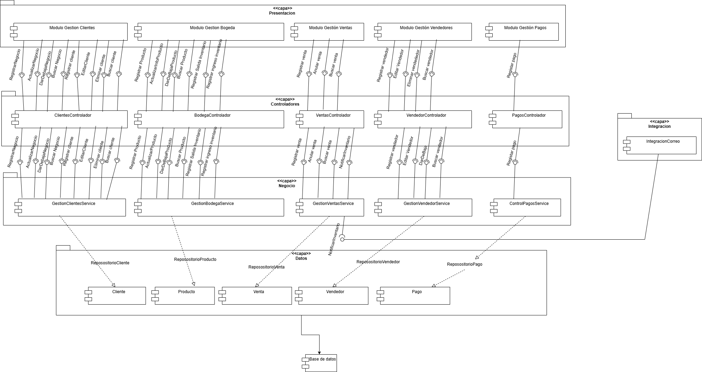

### 6.2 Diagrama de Distribucion
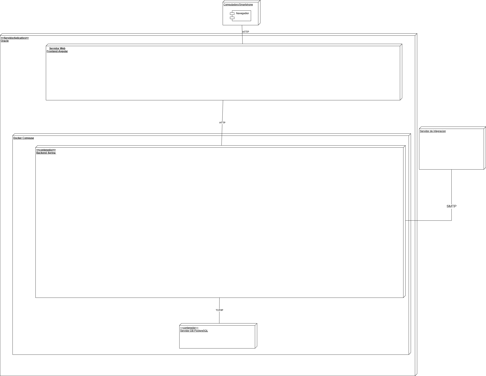

### 6.3 Digrama de Despliegue PIM
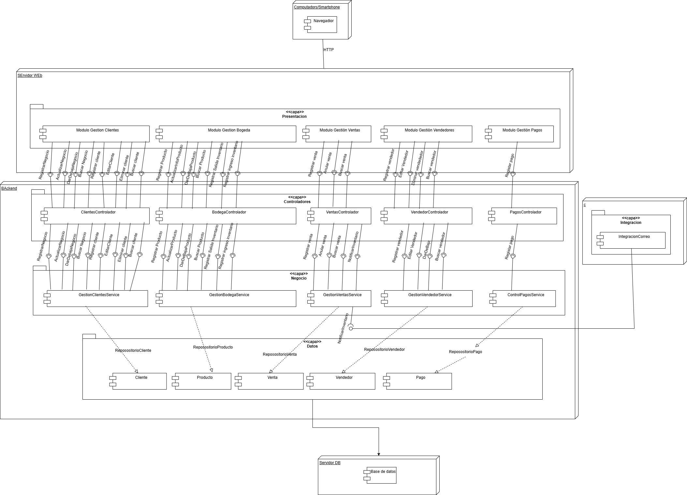

### 6.3 Digrama de Despliegue PSM
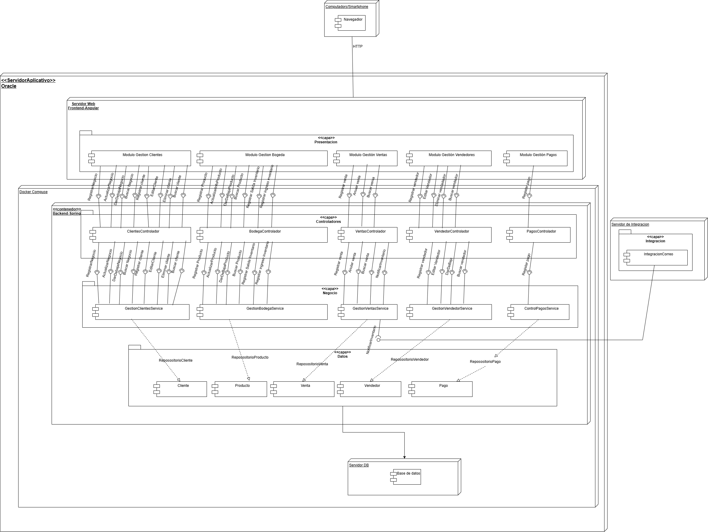

### Justificacion de Frameworks y tecnologias
Para el desarrollo del backend se ha optado por el framework Spring Boot sobre el lenguaje de programación Java, debido a sus ventajas en la construcción de aplicaciones empresariales robustas y escalables.

#### Java + Spring Boot (Backend)
El backend de IMPORCOMGUA estará construido con Spring Boot, un framework moderno sobre Java que organiza el código en capas bien definidas: controladores, servicios y acceso a datos. Esto ayuda en la arquitectura a:

* Establecer una arquitectura lógica clara, donde cada módulo funcional (ventas, pagos, inventario, empleados, etc.) tiene una ubicación específica y fácilmente identificable.

* Mantener una correspondencia directa entre los casos de uso documentados y su implementación técnica, lo que facilita la trazabilidad entre los requerimientos del negocio y el código fuente.

* Soporte nativo para seguridad, autenticación y validación, útil para la gestión de usuarios y control de acceso.

* Aprovechar herramientas como validadores, control de errores, seguridad y configuración externa, que permiten enfocar el desarrollo en la lógica del negocio.

En el diagrama de despliegue, el contenedor del backend representa este núcleo funcional del sistema, separado del frontend y la base de datos, facilitando su comprensión y mantenimiento independiente.
#### Base de datos: PostgreSQL
Se eligió PostgreSQL como sistema de gestión de base de datos relacional (RDBMS) por su solidez, compatibilidad con estándares SQL y extensiones avanzadas. Estas serviran en la arquitectura para:

* Manejar relaciones complejas y garantizar integridad referencial entre las entidades del sistema.

* Ejecutar consultas eficientes gracias a índices, funciones agregadas y soporte para procedimientos almacenados.

* Integración eficiente con librerías de persistencia como JPA/Hibernate, lo cual facilita el mapeo de entidades desde PostgreSQL.

* Ofrecer una solución escalable y segura, sin costos de licenciamiento.

PostgreSQL asegura un backend de datos confiable, ideal para los módulos de ventas, pagos, inventario y clientes.

#### Angular (Frontend)
El frontend será desarrollado con Angular, un framework basado en TypeScript que permite organizar la interfaz de usuario en componentes reutilizables, cada uno asociado a una funcionalidad del sistema.

* Permite desarrollar una interfaz modular y reutilizable, organizada por componentes.

* Angular facilita el desarrollo de una interfaz rica y reactiva, que mejora la experiencia del usuario sin comprometer la claridad estructural del sistema.

* Integra mecanismos nativos de consumo de APIs RESTful, facilitando la conexión con el backend de Spring Boot.

* Se integrará una librería de componentes visuales para garantizar consistencia, accesibilidad y eficiencia en el diseño de pantallas.

Gracias a esta división, es fácil comprender cómo las vistas del usuario se comunican con el sistema y cómo cada acción corresponde a un flujo entre componentes documentado gráficamente.

#### Docker (Contenedores)
La utilización de contenedores Docker tanto para el backend como para el frontend:

* Representar de forma visual y clara la arquitectura modular del sistema, como se muestra en el diagrama de despliegue.
*Despliegue estandarizado y portable.

* Facilitar el aislamiento y la independencia de los servicios, lo que mejora la comprensión del entorno de ejecución del sistema.

* Reproducir fácilmente entornos de desarrollo y producción, garantizando coherencia en todas las etapas del ciclo de vida del software.

* Posibilita una mayor integración con herramientas CI/CD en fases futuras del proyecto

La combinación de Spring Boot + PostgreSQL + Angular, empaquetados en contenedores Docker, responde a las necesidades del proyecto IMPORCOMGUA en términos de modularidad, mantenibilidad, escalabilidad y portabilidad.

## 7. Diagrama Entidad Relación
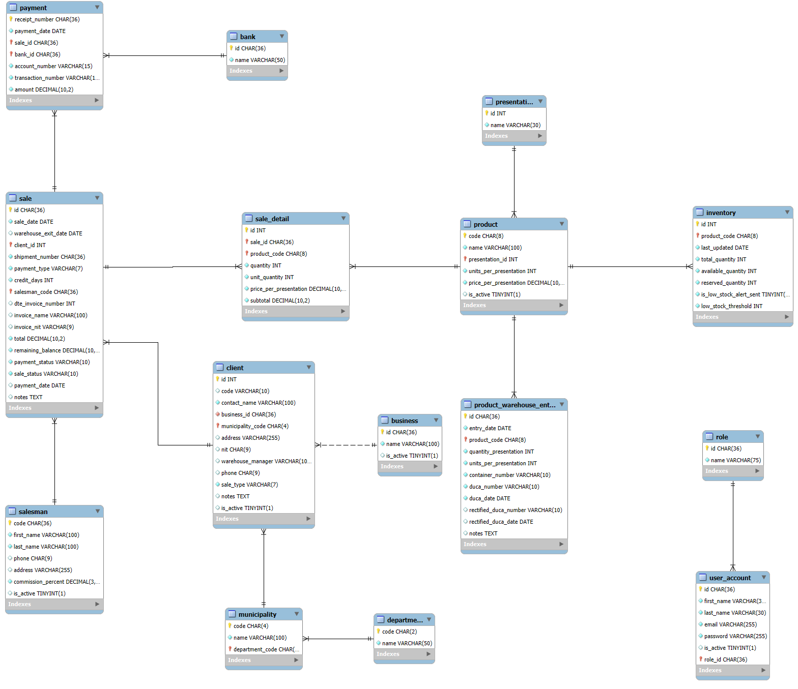

## 8. Gestión del Proyecto

Utilizamos [Trello](https://trello.com) para planificar, asignar y seguir el avance de tareas del proyecto. A continuación, algunas capturas:

### Acceso al Tablero Trello

Puedes ver el tablero completo aquí:  
🔗 [Tablero Trello de IMPORCOMGUA](https://trello.com/invite/b/6847ba5b69dfcd9af1c397e7/ATTIb7e79dd9e84a644089e6ced6e8777d17530D11B0/ayd2v1s2025proyectog9)