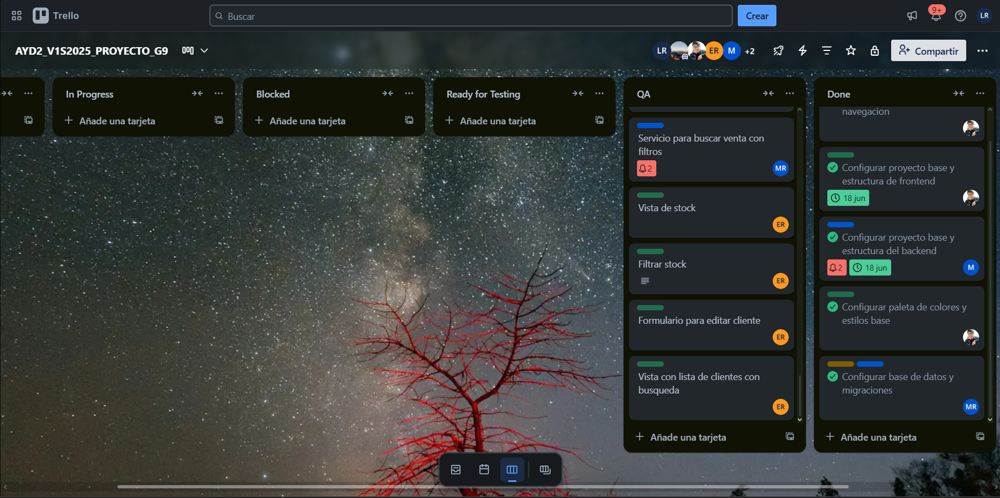

# Sprint 1 - Documentación Scrum

Este documento contiene la evidencia y documentación del desarrollo del **Sprint 1** durante la Fase 2 del proyecto. Se incluyen los registros diarios, la planificación inicial, y la retrospectiva del equipo al finalizar el sprint.
---

## 🗂️ Sprint Planning
### 🎯 Objetivo del Sprint
Tener un Producto Mínimo Viable (MVP) del sistema de automatización para IMPORCOMGUA, que incluya las funcionalidades esenciales (drivers funcionales) identificadas en conjunto con el cliente. Estas funcionalidades permitirán gestionar el inventario, las ventas, los pagos y el mantenimiento de clientes, productos y vendedores.

### Sprint Backlog
| ID   | Historia de Usuario                                                                  | Tareas                                                                                                                                        | Prioridad |
| ---- | ------------------------------------------------------------------------------------ | --------------------------------------------------------------------------------------------------------------------------------------------- | --------- |
| US01 | Como administrador quiero registrar ventas para llevar control diario                | Diseñar formulario de venta, Validar productos seleccionados, Implementar lógica en backend para registrar venta y asociar cliente y vendedor | Alta      |
| US02 | Como administrador deseo registrar el ingreso de productos al inventario             | Diseñar interfaz de ingreso, Validar datos, Implementar lógica en backend para registrar ingreso y actualizar stock                           | Alta      |
| US03 | Como administrador quiero registrar salidas de inventario para mantener trazabilidad | Diseñar formulario, Validar cantidades, Implementar lógica en backend para registrar salida y ajustar inventario                              | Media-Alta     |
| US04 | Como cajero deseo registrar pagos de clientes                                        | Diseñar módulo de pagos, Validar monto, Implementar lógica en backend para registrar el pago y asociarlo a la venta                           | Media-Alta     |
| US05 | Como administrador deseo gestionar clientes                                          | Diseñar formularios para agregar, editar y eliminar, Implementar lógica en backend para CRUD de clientes                                      | Alta      |
| US06 | Como administrador deseo gestionar productos                                         | Diseñar formularios para agregar, editar y eliminar, Implementar lógica en backend para CRUD de productos                                     | Alta      |
| US07 | Como administrador deseo gestionar vendedores                                        | Diseñar formularios para agregar, editar y eliminar, Implementar lógica en backend para CRUD de vendedores                                    | Media-Alta     |

### Tablero Inicial

Imagen del tablero al inicio del sprint:

---

## 📅 Daily Standup
Se grabó cada daily y se puede encontrar en la siguiente [carpeta de drive](https://drive.google.com/drive/folders/1cfmjz10v609Wzfselk9M3RHIlcwegJWg?usp=sharing)

Ademas, cada integrante del equipo documentó diariamente lo siguiente:

- ✅ Qué hizo el día anterior
- 🔜 Qué planea hacer el día actual
- ⚠️ Si tiene algún impedimento

Los registros diarios se encuentran en la carpeta [`daily-transcripts/`](./daily-transcripts), organizados por miembro del equipo:

1. [`Manuel Rojas`](./daily-transcripts/manuel-rojas.md)
2. [`Luis Cifuentes`](./daily-transcripts/luis-cifuentes.md)
3. [`Bilhán López`](./daily-transcripts/bilhan-lopez.md)
4. [`José Alarcón`](./daily-transcripts/jose-alarcon.md)
5. [`Jaqueline Cifuentes`](./daily-transcripts/jaqueline-cifuentes.md)
6. [`Hector Son`](./daily-transcripts/hector-son.md)
7. [`Estuardo Ramos`](./daily-transcripts/estuardo-ramos.md)

---

### Sprint Retrospective

