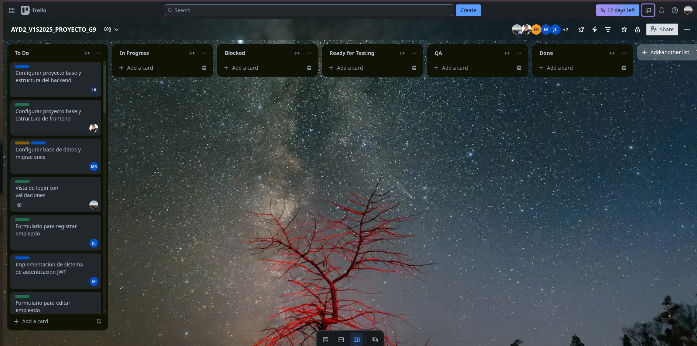

# Sprint 1 - Documentación Scrum

Este documento contiene la evidencia y documentación del desarrollo del **Sprint 1** durante la Fase 2 del proyecto. Se incluyen los registros diarios, la planificación inicial, y la retrospectiva del equipo al finalizar el sprint.
---

## 🗂️ Sprint Planning
### 🎯 Objetivo del Sprint
Tener un Producto Mínimo Viable (MVP) del sistema de automatización para IMPORCOMGUA, que incluya las funcionalidades esenciales (drivers funcionales) identificadas en conjunto con el cliente. Estas funcionalidades permitirán gestionar el inventario, las ventas, los pagos y el mantenimiento de clientes, productos y vendedores.

### Sprint Backlog

| ID | Historia de Usuario | Tareas | Prioridad	|
|	:---:	|	-----	|	-----	| :------: 	|
|	US01	|	Como administrador quiero registrar ventas para llevar control diario               	|	1.	Diseñar formulario para ventas con campos de cliente, productos, cantidades, total. 2.	Crear servicio backend para registrar la venta (incluyendo lógica de stock). 3.	Permitir búsqueda de ventas por cliente, fecha o estado. 4.	Permitir anulación de ventas con justificación (modal + servicio). 5.	Mostrar historial de ventas con filtros.	|	 Alta      	|
|	US02	|	Como administrador deseo registrar el ingreso de productos al inventario            	|	1.	Crear interfaz para registrar nuevos ingresos a inventario. 2.	Validar existencia de producto y cantidad ingresada. 3.	Actualizar automáticamente el stock al registrar el ingreso. 4.	Mostrar confirmación y registro histórico de ingresos. "	|	 Alta     	|
|	US03	|	Como administrador quiero registrar salidas de inventario para mantener trazabilidad	|	1.	Diseñar formulario con producto, cantidad y motivo de salida. 2.	Validar que la cantidad no exceda el stock actual. 3.	Registrar salida en el sistema con fecha y usuario. 4.	Mostrar historial de salidas por producto."	|	 Media-Alta    	|
|	US04	|	Como cajero deseo registrar pagos de clientes                                       	|	1.	Crear servicio para registrar pagos asociados a una venta. 2.	Validar monto ingresado y actualizar estado de la venta. 3.	Permitir ver historial de pagos de un cliente.	|	 Media-Alta    	|
|	US05	|	 Como administrador deseo gestionar clientes                                         	|	1.	Formularios para crear, editar y eliminar clientes. 2.	Servicios backend para registrar, editar, eliminar y buscar clientes. 3.	Vista que permita listar clientes con filtros por nombre, correo, estado. 4.	Confirmaciones visuales (modales) para eliminar clientes.	|	 Alta     	|
|	US06	|	 Como administrador deseo gestionar productos                                        	|	1.	Formularios para crear y editar productos con validaciones. 2.	Vista con búsqueda de productos por nombre o categoría. 3.	Servicios backend para registrar, buscar, editar y eliminar productos. 4.	Confirmación para eliminación de productos mediante modal.	|	 Alta     	|
|	US07	|	 Como administrador deseo gestionar vendedores                                       	|	1.	Formularios para añadir y editar vendedores. 2.	Vista de lista de vendedores con búsqueda por nombre o estado. 3.	Modal de confirmación para dar de baja (eliminación lógica). 4.	Servicio backend para búsquedas filtradas.	|	 Media-Alta    	|

### Tablero Inicial

Imagen del tablero al inicio del sprint:

---

## 📅 Daily Standup
Se grabó cada daily y se puede encontrar en la siguiente [carpeta de drive](https://drive.google.com/drive/folders/1cfmjz10v609Wzfselk9M3RHIlcwegJWg?usp=sharing)

Ademas, cada integrante del equipo documentó diariamente lo siguiente:

- ✅ Qué hizo el día anterior
- 🔜 Qué planea hacer el día actual
- ⚠️ Si tiene algún impedimento

Los registros diarios se encuentran en la carpeta [`daily-transcripts/`](./daily-transcripts), organizados por miembro del equipo:

1. [`Manuel Rojas`](./daily-transcripts/manuel-rojas.md)
2. [`Luis Cifuentes`](./daily-transcripts/luis-cifuentes.md)
3. [`Bilhán López`](./daily-transcripts/bilhan-lopez.md)
4. [`José Alarcón`](./daily-transcripts/jose-alarcon.md)
5. [`Jaqueline Cifuentes`](./daily-transcripts/jaqueline-cifuentes.md)
6. [`Hector Son`](./daily-transcripts/hector-son.md)
7. [`Estuardo Ramos`](./daily-transcripts/estuardo-ramos.md)

---