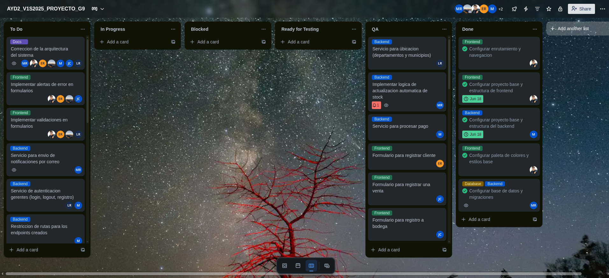

# Sprint 2 - Documentación Scrum

Este documento contiene la evidencia y documentación del desarrollo del **Sprint 2** durante la Fase 3 del proyecto. Se incluyen los registros diarios, la planificación inicial, y la retrospectiva del equipo al finalizar el sprint.
---

## 🗂️ Sprint Planning
### 🎯 Objetivo del Sprint
El objetivo de este segundo sprint es completar el desarrollo del sistema basado en el MVP previamente validado, integrando todas las funcionalidades restantes necesarias para su operación estable. Esto incluye la implementación del sistema de gestión de roles con control de acceso por perfil y notificaciones por umbrales definidos de productos, garantizando trazabilidad y separación de responsabilidades; la ejecución de pruebas funcionales para validar el comportamiento de cada módulo; la configuración de un proceso de integración y despliegue continuo (CI/CD); y el despliegue final del sistema en la nube para su uso en entorno de producción.

### Sprint Backlog

| ID  | Historia de Usuario | Tareas | Prioridad |
|-----|---------------------|--------|-----------|
|   US08   |   Como Gerente General, quiero gestionar roles de usuarios para controlar accesos al sistema. | 1. Diseñar interfaz de gestión de roles (CRUD).   2. Implementar servicios backend para asignar/editar roles.   3. Validar permisos por rol en cada módulo.   4. Crear modal de confirmación para cambios críticos. | Alta |
|   US09   |   Como Gerente de Inventario, quiero recibir alertas por correo cuando el stock esté bajo mínimos. | 1. Integrar API de proveedor de correo.   2. Desarrollar lógica de comparación de stock.   3. Diseñar plantilla de correo.   4. Configurar destinatarios automáticos. | Alta |
|   US10   |   Como equipo de desarrollo, necesitamos implementar CI/CD para despliegues automatizados. | 1. Configurar pipeline (GitHub Actions/GitLab CI).   2. Automatizar pruebas en el pipeline.   3. Crear scripts para despliegue en la nube.   4. Documentar variables de entorno. | Crítica |
|   US11   |   Como administrador, quiero ver un historial de cambios en roles y accesos. | 1. Diseñar tabla de auditoría.   2. Implementar servicio de registros.   3. Filtrar historial por usuario/fecha. | Media |
|   US12   |   Como Gerente de Ventas, quiero asegurar que mi rol solo permita acceder a módulos de ventas y pagos. | 1. Validar permisos en frontend.   2. Implementar middleware de autenticación.   3. Pruebas de acceso con roles falsos. | Media-Alta |
|   US13   |   Como equipo, debemos completar funcionalidades pendientes del MVP. | 1. Corregir bugs reportados en Fase II.   2. Implementar reportes estratégicos.   3. Optimizar consultas de inventario. | Alta |
|   US14   |   Como tester, necesito ejecutar pruebas de aceptación antes del despliegue final. | 1. Documentar casos de prueba.   2. Grabar videos de pruebas.   3. Validar flujo de CI/CD. | Media |

### Tablero Inicial

Imagen del tablero al inicio del sprint:

---

## 📅 Daily Standup
Se grabó cada daily y se puede encontrar en la siguiente [carpeta de drive](https://drive.google.com/drive/folders/1q_tYWLET2codkfn7exos6uZHE68RO3xP?usp=drive_link)

Ademas, cada integrante del equipo documentó diariamente lo siguiente:

- ✅ Qué hizo el día anterior
- 🔜 Qué planea hacer el día actual
- ⚠️ Si tiene algún impedimento

Los registros diarios se encuentran en la carpeta [`daily-transcripts/`](./daily-transcripts), organizados por miembro del equipo:

1. [`Manuel Rojas`](./daily-transcripts/manuel-rojas.md)
2. [`Luis Cifuentes`](./daily-transcripts/luis-cifuentes.md)
3. [`Bilhán López`](./daily-transcripts/bilhan-lopez.md)
4. [`José Alarcón`](./daily-transcripts/jose-alarcon.md)
5. [`Jaqueline Cifuentes`](./daily-transcripts/jaqueline-cifuentes.md)
6. [`Hector Son`](./daily-transcripts/hector-son.md)
7. [`Estuardo Ramos`](./daily-transcripts/estuardo-ramos.md)

---

